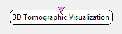

.. _Doc_BoxAlgorithm_3DTomographicVisualization:

3D Tomographic Visualization
============================

.. container:: attribution

   :Author:
      Yann Renard
   :Company:
      Mensia Technologies SA

The *3D Tomographic Visualization* is designed to display the output of a signal filtered using the a tomographic reconstruction algorithm such as LORETA.
LORETA computes the spatial filter that transforms an input signal with :math:`C` channels/sensors to :math:`V =` 2394 sources. 
These sources form a subdivision of the brain in 3 dimensions, each source being encoded as a small cube (7mm resolution) called *voxel*. The input to the box should thus be a matrix of 2394x3 values.

The *3D Tomographic Visualization* box shares common concepts and settings with the other boxes in the **Mensia Advanced Visualization Toolset**.
Additional information are available in the dedicated documentation pages:

- :ref:`Doc_Mensia_AdvViz_Concepts`
- :ref:`Doc_Mensia_AdvViz_Configuration`

Inputs
------

.. csv-table::
   :header: "Input Name", "Stream Type"

   "Matrix", "Signal"

Matrix
~~~~~~

This box expects a source current density power stream coming from a LORETA transformation, ie matrices of :math:`V =` 2394 channels, one value per voxel of the reconstruction.

.. _Doc_BoxAlgorithm_3DTomographicVisualization_Settings:

Settings
--------

.. csv-table::
   :header: "Setting Name", "Type", "Default Value"

   "Gain", "Float", "1"
   "Caption", "String", ""
   "Translucency", "Float", "1"
   "Color", "Color Gradient", "${AdvancedViz_DefaultColorGradient}"

Gain
~~~~

Gain (floating-point scalar factor) to apply to the input values before display.

Caption
~~~~~~~

Label to be displayed on top of the visualization window.

Translucency
~~~~~~~~~~~~

This setting expect a value between 0 and 1, from transparent to opaque color rendering (nb: this value is the alpha component of the color).

Color
~~~~~

Color gradient to use. This setting can be set manually using the color gradient editor.
Several presets exist in form of configuration tokens ``${AdvancedViz_ColorGradient_X}``, where X can be:

- ``Matlab`` or ``Matlab_Discrete``
- ``Icon`` or ``Icon_Discrete``
- ``Elan`` or ``Elan_Discrete``
- ``Fire`` or ``Fire_Discrete``
- ``IceAndFire`` or ``IceAndFire_Discrete``

The default values ``AdvancedViz_DefaultColorGradient`` or ``AdvancedViz_DefaultColorGradient_Discrete`` are equal to </t>Matlab</tt> and ``Matlab_Discrete``.

An example of topography rendering using these color gradients can be found :ref:`Doc_Mensia_AdvViz_Configuration` "here".

.. _Doc_BoxAlgorithm_3DTomographicVisualization_VizSettings:

Visualization Settings
----------------------

At runtime, all the advanced visualization shared settings are exposed, as described in :ref:`Doc_Mensia_AdvViz_Configuration_RuntimeToolbar`.
Note that if the box receives a discontinuous data stream, such as a re-epoched signal through stimulation based epoching, the ERP replay features is exposed.
Using the ERP replay allows you to slowly visualize the last epoch received.

.. _Doc_BoxAlgorithm_3DTomographicVisualization_Examples:

Examples
--------

In the following example, we compute the alpha band power of the signal, and deduce the corresponding sources activity using 
an inverse model of the headset (eLORETA), that outputs the source components along x, y and z axis and the source current density power.

You can find a commented scenario in the provided sample set, the scenario file name is \textit{3DTomographicVisualization.xml}.

.. figure:: images/3DTomographicVisualization_Example.png
   :alt: Example of scenario using the 3D Tomographic Visualization
   :align: center

   Example of scenario using the 3D Tomographic Visualization

