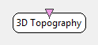

.. _Doc_BoxAlgorithm_3DTopography:

3D Topography
=============

.. container:: attribution

   :Author:
      Yann Renard
   :Company:
      Mensia Technologies SA

The *3D Topography* box combines EEG measures with topological information. 
The input, being signal, spectrum, or any other metric, is mapped to a 3D model of the scalp.
This box is provided with a preconfigured channel localisation file that contains the cartesian coordinates of every electrode positions of the extended 10-20 system.
The mapping is done according to these coordinates using spherical spline interpolation.
A color gradient is used to display the information, and can be customized at will to easily enhance or smooth the contrasts.
Several presets are available, to match the gradients you may be already familiar with when using existing softwares such as Matlab or Elan.
The color gradient is mapped to the current data scale, centered around 0.

The *3D Topography* box shares common concepts and settings with the other boxes in the **Mensia Advanced Visualization Toolset**.
Additional information are available in the dedicated documentation pages:

- :ref:`Doc_Mensia_AdvViz_Concepts`
- :ref:`Doc_Mensia_AdvViz_Configuration`

Inputs
------

.. csv-table::
   :header: "Input Name", "Stream Type"

   "Matrix", "Signal"

Matrix
~~~~~~

The box input can be a streamed matrix or any derived stream (Signal, Spectrum, Feature Vector).
Please set the input type according to the actual stream type connected.

.. _Doc_BoxAlgorithm_3DTopography_Settings:

Settings
--------

.. csv-table::
   :header: "Setting Name", "Type", "Default Value"

   "Channel Localisation", "Filename", "${AdvancedViz_ChannelLocalisation}"
   "Gain", "Float", "1"
   "Caption", "String", ""
   "Color", "Color Gradient", "${AdvancedViz_DefaultColorGradient}"

Channel Localisation
~~~~~~~~~~~~~~~~~~~~

The channel localisation file containing the cartesian coordinates of the electrodes to be displayed.
A default configuration file is provided, and its path stored in the configuration token ``${AdvancedViz_ChannelLocalisation}``.

Gain
~~~~

Gain (floating-point scalar factor) to apply to the input signal before display.

Caption
~~~~~~~

Label to be displayed on top of the visualization window.

Color
~~~~~

Color gradient to use. This setting can be set manually using the color gradient editor.
Several presets exist in form of configuration tokens ``${AdvancedViz_ColorGradient_X}``, where X can be:

- ``Matlab`` or ``Matlab_Discrete``
- ``Icon`` or ``Icon_Discrete``
- ``Elan`` or ``Elan_Discrete``
- ``Fire`` or ``Fire_Discrete``
- ``IceAndFire`` or ``IceAndFire_Discrete``

The default values ``AdvancedViz_DefaultColorGradient`` or ``AdvancedViz_DefaultColorGradient_Discrete`` are equal to </t>Matlab</tt> and ``Matlab_Discrete``.

An example of topography rendering using these color gradients can be found :ref:`Doc_Mensia_AdvViz_Configuration` "here".

.. _Doc_BoxAlgorithm_3DTopography_VizSettings:

Visualization Settings
----------------------

At runtime, all the advanced visualization shared settings are exposed, as described in :ref:`Doc_Mensia_AdvViz_Configuration_RuntimeToolbar`.

For the 3D topography, please note that:

- **Select Channels** : the selected channel are symbolized with a small white cube, which turns grey when unselected.

Note that if the box receives a discontinuous data stream, such as a re-epoched signal through stimulation based epoching, the ERP replay features is exposed.
Using the ERP replay allows you to slowly visualize the last epoch received.

.. _Doc_BoxAlgorithm_3DTopography_Examples:

Examples
--------

In the following example, we compute the band power of the signal in the 8-15 Hz frequency range, and average it over the last 32 epochs received.

You can find a commented scenario in the provided sample set, the scenario file name is \textit{3DTopography.xml}.

.. figure:: images/3DTopography_Example.png
   :alt: Example of scenario using the 3D topography
   :align: center

   Example of scenario using the 3D topography

