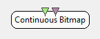

.. _Doc_BoxAlgorithm_ContinuousBitmap:

Continuous Bitmap
=================

.. container:: attribution

   :Author:
      Yann Renard
   :Company:
      Mensia Technologies SA

The *Continuous Bitmap* displays input data in form of a 2D map of colored blocks (or *bitmap*).
The display is done **continuously** , meaning that once the end of the horizontal scale is reached, it goes back to the origin.

The *Continuous Bitmap* box shares common concepts and settings with the other boxes in the **Mensia Advanced Visualization Toolset**.
Additional information are available in the dedicated documentation pages:

- :ref:`Doc_Mensia_AdvViz_Concepts`
- :ref:`Doc_Mensia_AdvViz_Configuration`

Inputs
------

.. csv-table::
   :header: "Input Name", "Stream Type"

   "Matrix", "Streamed matrix"
   "Markers", "Stimulations"

Matrix
~~~~~~

The first input can be a streamed matrix or any derived stream (Signal, Spectrum, Feature Vector).
Please set the input type according to the actual stream type connected.

Markers
~~~~~~~

The second input expect stimulations. They will be displayed as **red vertical lines**.

.. _Doc_BoxAlgorithm_ContinuousBitmap_Settings:

Settings
--------

.. csv-table::
   :header: "Setting Name", "Type", "Default Value"

   "Channel Localisation", "Filename", "${AdvancedViz_ChannelLocalisation}"
   "Temporal Coherence", "Temporal Coherence", "Time Locked"
   "Time Scale", "Float", "20"
   "Matrix Count", "Integer", "50"
   "Gain", "Float", "1"
   "Caption", "String", ""
   "Color", "Color Gradient", "${AdvancedViz_DefaultColorGradient}"

Channel Localisation
~~~~~~~~~~~~~~~~~~~~

The channel localisation file containing the cartesian coordinates of the electrodes to be displayed.
A default configuration file is provided, and its path stored in the configuration token ``${AdvancedViz_ChannelLocalisation}``.

Temporal Coherence
~~~~~~~~~~~~~~~~~~

Select *Time Locked* for a continuous data stream, and specify the *time scale* below.
Select *Independent* for a discontinuous data stream, and specify the *matrix count* below.

Time Scale
~~~~~~~~~~

The time scale in seconds, before the displays goes back to the origin.

Matrix Count
~~~~~~~~~~~~

The number of input matrices to receive before the displays goes back to the origin.

Gain
~~~~

If this checkbox is ticked, the vertical scale is shifted so that 0 is at the bottom. Only positive values will be displayed.

Caption
~~~~~~~

Gain (floating-point scalar factor) to apply to the input values before display.

Color
~~~~~

Label to be displayed on top of the visualization window.

.. _Doc_BoxAlgorithm_ContinuousBitmap_VizSettings:

Visualization Settings
----------------------

At runtime, all the advanced visualization shared settings are exposed, as described in :ref:`Doc_Mensia_AdvViz_Configuration_RuntimeToolbar`.

.. _Doc_BoxAlgorithm_ContinuousBitmap_Examples:

Examples
--------

In the following example, we compute the band power of the input signal in the 8-15 Hz frequency range, and average it over the last 32 epochs received.

You can find a commented scenario in the provided sample set, the scenario file name is \textit{ContinuousBitmap.xml}.

.. figure:: images/ContinuousBitmap_Example.png
   :alt: Example of scenario using the Continuous Bitmap
   :align: center

   Example of scenario using the Continuous Bitmap

