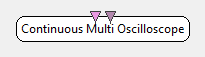

.. _Doc_BoxAlgorithm_ContinuousMultiOscilloscope:

Continuous Multi Oscilloscope
=============================

.. container:: attribution

   :Author:
      Yann Renard
   :Company:
      Mensia Technologies SA

The *Continuous Multi-Oscilloscope* displays temporal numerical data in the form of curves, on the same vertical axis.
Each channel is given a color according to a color gradient, rendered additively.
The display is done **continuously** , meaning that once the end of the horizontal scale is reached, it goes back to the origin.

The *Continuous Multi-Oscilloscope* box shares common concepts and settings with the other boxes in the **Mensia Advanced Visualization Toolset**.
Additional information are available in the dedicated documentation pages:

- :ref:`Doc_Mensia_AdvViz_Concepts`
- :ref:`Doc_Mensia_AdvViz_Configuration`

Inputs
------

.. csv-table::
   :header: "Input Name", "Stream Type"

   "Matrix", "Signal"
   "Markers", "Stimulations"

Matrix
~~~~~~

The first input can be a streamed matrix or any derived stream (Signal, Spectrum, Feature Vector).
Please set the input type according to the actual stream type connected.

Markers
~~~~~~~

The second input expect stimulations. They will be displayed as **red vertical lines**.

.. _Doc_BoxAlgorithm_ContinuousMultiOscilloscope_Settings:

Settings
--------

.. csv-table::
   :header: "Setting Name", "Type", "Default Value"

   "Channel Localisation", "Filename", "${AdvancedViz_ChannelLocalisation}"
   "Temporal Coherence", "Temporal Coherence", "Time Locked"
   "Time Scale", "Float", "20"
   "Matrix Count", "Integer", "50"
   "Positive Data Only ?", "Boolean", "false"
   "Gain", "Float", "1"
   "Caption", "String", ""
   "Translucency", "Float", "1"
   "Color", "Color Gradient", "${AdvancedViz_DefaultColorGradient}"

Channel Localisation
~~~~~~~~~~~~~~~~~~~~

The channel localisation file containing the cartesian coordinates of the electrodes to be displayed.
A default configuration file is provided, and its path stored in the configuration token ``${AdvancedViz_ChannelLocalisation}``.

Temporal Coherence
~~~~~~~~~~~~~~~~~~

Select *Time Locked* for a continuous data stream, and specify the *time scale* below.
Select *Independent* for a discontinuous data stream, and specify the *matrix count* below.

Time Scale
~~~~~~~~~~

The time scale in seconds, before the displays goes back to the origin.

Matrix Count
~~~~~~~~~~~~

The number of input matrices to receive before the displays goes back to the origin.

Positive Data Only ?
~~~~~~~~~~~~~~~~~~~~

If this checkbox is ticked, the vertical scale is shifted so that 0 is at the bottom. Only positive values will be displayed.

Gain
~~~~

Gain (floating-point scalar factor) to apply to the input values before display.

Caption
~~~~~~~

Label to be displayed on top of the visualization window.

Translucency
~~~~~~~~~~~~

This setting expect a value between 0 and 1, from transparent to opaque color rendering (nb: this value is the alpha component of the color).

Color
~~~~~

Color gradient to use. This setting can be set manually using the color gradient editor.
Several presets exist in form of configuration tokens ``${AdvancedViz_ColorGradient_X}``, where X can be:

- ``Matlab`` or ``Matlab_Discrete``
- ``Icon`` or ``Icon_Discrete``
- ``Elan`` or ``Elan_Discrete``
- ``Fire`` or ``Fire_Discrete``
- ``IceAndFire`` or ``IceAndFire_Discrete``

The default values ``AdvancedViz_DefaultColorGradient`` or ``AdvancedViz_DefaultColorGradient_Discrete`` are equal to </t>Matlab</tt> and ``Matlab_Discrete``.

An example of topography rendering using these color gradients can be found :ref:`Doc_Mensia_AdvViz_Configuration` "here".

.. _Doc_BoxAlgorithm_ContinuousMultiOscilloscope_VizSettings:

Visualization Settings
----------------------

At runtime, all the advanced visualization shared settings are exposed, as described in :ref:`Doc_Mensia_AdvViz_Configuration_RuntimeToolbar`.

.. _Doc_BoxAlgorithm_ContinuousMultiOscilloscope_Examples:

Examples
--------

In the following example, we compute the band power of the input signal in the 8-15 Hz frequency range, and average it over the last 32 epochs received.

You can find a commented scenario in the provided sample set, the scenario file name is \textit{ContinuousMultiOscilloscope.xml}.

.. figure:: images/ContinuousMultiOscilloscope_Example.png
   :alt: Example of scenario using the Continuous Multi-Oscilloscope
   :align: center

   Example of scenario using the Continuous Multi-Oscilloscope

