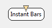
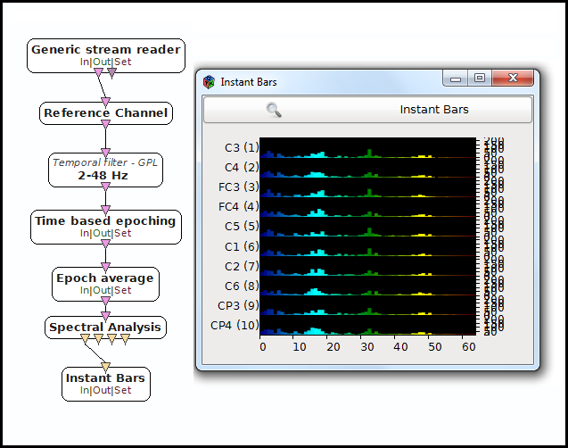

.. _Doc_BoxAlgorithm_InstantBars:

Instant Bars
============

.. container:: attribution

   :Author:
      Yann Renard
   :Company:
      Mensia Technologies SA

The *Instant Bars* box displays input data in form of **vertical level bars**, one bar per value, one series of bar for each channel.
The display is done **instantly** , meaning that whenever a new data block arrives, it is displayed in the visualization windows, filling all the vertical space.
For lisibility (and esthetical) purpose, the bars are colored in a custom gradient (from left to right).

This box is especially suitable for displaying **spectrum**.

The *Instant Bars* box shares common concepts and settings with the other boxes of the **Mensia Advanced Visualization Toolset**.
Additional information are available in the dedicated documentation pages:

- :ref:`Doc_Mensia_AdvViz_Concepts`
- :ref:`Doc_Mensia_AdvViz_Configuration`

Inputs
------

.. csv-table::
   :header: "Input Name", "Stream Type"

   "Matrix", "Spectrum"

Matrix
~~~~~~

The input can be a streamed matrix or any derived stream (Signal, Spectrum, Feature Vector).
Please set the input type according to the actual stream type connected.

.. _Doc_BoxAlgorithm_InstantBars_Settings:

Settings
--------

.. csv-table::
   :header: "Setting Name", "Type", "Default Value"

   "Channel Localisation", "Filename", "${AdvancedViz_ChannelLocalisation}"
   "Positive Data Only ?", "Boolean", "false"
   "Gain", "Float", "1"
   "Caption", "String", ""
   "Translucency", "Float", "1"
   "Color", "Color Gradient", "${AdvancedViz_DefaultColorGradient}"

Channel Localisation
~~~~~~~~~~~~~~~~~~~~

The channel localisation file containing the cartesian coordinates of the electrodes to be displayed.
A default configuration file is provided, and its path stored in the configuration token ``${AdvancedViz_ChannelLocalisation}``.

Positive Data Only ?
~~~~~~~~~~~~~~~~~~~~

If this checkbox is ticked, the vertical scale is shifted so that 0 is at the bottom. Only positive values will be displayed.

Gain
~~~~

Gain (floating-point scalar factor) to apply to the input values before display.

Caption
~~~~~~~

Label to be displayed on top of the visualization window.

Translucency
~~~~~~~~~~~~

This setting expect a value between 0 and 1, from transparent to opaque color rendering (nb: this value is the alpha component of the color).

Color
~~~~~

Color gradient to use. This setting can be set manually using the color gradient editor.
Several presets exist in form of configuration tokens ``${AdvancedViz_ColorGradient_X}``, where X can be:

- ``Matlab`` or ``Matlab_Discrete``
- ``Icon`` or ``Icon_Discrete``
- ``Elan`` or ``Elan_Discrete``
- ``Fire`` or ``Fire_Discrete``
- ``IceAndFire`` or ``IceAndFire_Discrete``

The default values ``AdvancedViz_DefaultColorGradient`` or ``AdvancedViz_DefaultColorGradient_Discrete`` are equal to </t>Matlab</tt> and ``Matlab_Discrete``.

An example of topography rendering using these color gradients can be found :ref:`Doc_Mensia_AdvViz_Configuration` "here".

.. _Doc_BoxAlgorithm_InstantBars_VizSettings:

Visualization Settings
----------------------

At runtime, all the advanced visualization shared settings are exposed, as described in :ref:`Doc_Mensia_AdvViz_Configuration_RuntimeToolbar`.

.. _Doc_BoxAlgorithm_InstantBars_Examples:

Examples
--------

In the following example, we compute the FFT of the input EEG signal and display it.

You can find a commented scenario in the provided sample set, the scenario file name is \textit{InstantBars.xml}.

   Example of scenario using the Instant Bars to display spectrum

