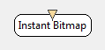

.. _Doc_BoxAlgorithm_InstantBitmap:

Instant Bitmap
==============

The *Instant Bitmap* box displays input data in form of a 2D map of colored blocks (or *bitmap*).
The display is done **instantly** , meaning that whenever a new data block arrives, it is displayed in the visualization windows, filling all the horizontal space.
The bitmap colors are chosen according to a custom gradient.

The *Instant Bitmap* box shares common concepts and settings with the other boxes of the **Mensia Advanced Visualization Toolset**.
Additional information are available in the dedicated documentation pages:

- :ref:`Doc_Mensia_AdvViz_Concepts`
- :ref:`Doc_Mensia_AdvViz_Configuration`

Inputs
------

.. csv-table::
   :header: "Input Name", "Stream Type"

   "Matrix", "Spectrum"

Matrix
~~~~~~

The input can be a streamed matrix or any derived stream (Signal, Spectrum, Feature Vector).
Please set the input type according to the actual stream type connected.

.. _Doc_BoxAlgorithm_InstantBitmap_Settings:

Settings
--------

.. csv-table::
   :header: "Setting Name", "Type", "Default Value"

   "Channel Localisation", "Filename", "${AdvancedViz_ChannelLocalisation}"
   "Gain", "Float", "1"
   "Caption", "String", ""
   "Color", "Color Gradient", "${AdvancedViz_DefaultColorGradient}"

Channel Localisation
~~~~~~~~~~~~~~~~~~~~

The channel localisation file containing the cartesian coordinates of the electrodes to be displayed.
A default configuration file is provided, and its path stored in the configuration token ``${AdvancedViz_ChannelLocalisation}``.

Gain
~~~~

Gain (floating-point scalar factor) to apply to the input values before display.

Caption
~~~~~~~

Label to be displayed on top of the visualization window.

Color
~~~~~

Color gradient to use. This setting can be set manually using the color gradient editor.
Several presets exist in form of configuration tokens ``${AdvancedViz_ColorGradient_X}``, where X can be:

- ``Matlab`` or ``Matlab_Discrete``
- ``Icon`` or ``Icon_Discrete``
- ``Elan`` or ``Elan_Discrete``
- ``Fire`` or ``Fire_Discrete``
- ``IceAndFire`` or ``IceAndFire_Discrete``

The default values ``AdvancedViz_DefaultColorGradient`` or ``AdvancedViz_DefaultColorGradient_Discrete`` are equal to </t>Matlab</tt> and ``Matlab_Discrete``.

An example of topography rendering using these color gradients can be found :ref:`Doc_Mensia_AdvViz_Configuration` "here".

.. _Doc_BoxAlgorithm_InstantBitmap_VizSettings:

Visualization Settings
----------------------

At runtime, all the advanced visualization shared settings are exposed, as described in :ref:`Doc_Mensia_AdvViz_Configuration_RuntimeToolbar`.

.. _Doc_BoxAlgorithm_InstantBitmap_Examples:

Examples
--------

In the following example, we compute the FFT of the input EEG signal and display it.

You can find a commented scenario in the provided sample set, the scenario file name is \textit{InstantBitmap.xml}.

.. figure:: images/InstantBitmap_Example.png
   :alt: Example of scenario using the Instant Bitmap to display spectrum
   :align: center

   Example of scenario using the Instant Bitmap to display spectrum

