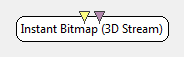

.. _Doc_BoxAlgorithm_InstantBitmap3DStream:

Instant Bitmap (3D Stream)
==========================

.. container:: attribution

   :Author:
      Yann Renard
   :Company:
      Mensia Technologies SA

The *Instant Bitmap (3D Stream)* box displays input data in form of 2D maps of colored blocks (or *bitmap*).
Each time a matrix is received, its contents are displayed to fill the visualization. Depending on the input type, the three dimensions of the matrix will be ordonned differently.
The bitmap colors are chosen according to a custom gradient.

Inputs
------

.. csv-table::
   :header: "Input Name", "Stream Type"

   "Matrix", "Time-frequency"
   "Markers", "Stimulations"

Matrix
~~~~~~

The input matrices to be displayed. Currently this box supports only the Time-Frequency stream.

Markers
~~~~~~~

The second input expects stimulations. They will be displayed as **colored vertical lines**.

.. _Doc_BoxAlgorithm_InstantBitmap3DStream_Settings:

Settings
--------

.. csv-table::
   :header: "Setting Name", "Type", "Default Value"

   "Channel Localisation", "Filename", "${AdvancedViz_ChannelLocalisation}"
   "Gain", "Float", "1"
   "Caption", "String", ""
   "Color", "Color Gradient", "${AdvancedViz_DefaultColorGradient}"

Channel Localisation
~~~~~~~~~~~~~~~~~~~~

The channel localisation file containing the cartesian coordinates of the electrodes to be displayed.
A default configuration file is provided, and its path stored in the configuration token ``${AdvancedViz_ChannelLocalisation}``.

Gain
~~~~

Gain (floating-point scalar factor) to apply to the input values before display.

Caption
~~~~~~~

Label to be displayed on top of the visualization window.

Color
~~~~~

Color gradient to use. This setting can be set manually using the color gradient editor.
Several presets exist in form of configuration tokens ``${AdvancedViz_ColorGradient_X}``, where X can be:

- ``Matlab`` or ``Matlab_Discrete``
- ``Icon`` or ``Icon_Discrete``
- ``Elan`` or ``Elan_Discrete``
- ``Fire`` or ``Fire_Discrete``
- ``IceAndFire`` or ``IceAndFire_Discrete``

The default values ``AdvancedViz_DefaultColorGradient`` or ``AdvancedViz_DefaultColorGradient_Discrete`` are equal to ``Matlab`` and ``Matlab_Discrete``.

An example of topography rendering using these color gradients can be found :ref:`Doc_Mensia_AdvViz_Configuration` "here".

.. _Doc_BoxAlgorithm_InstantBitmap3DStream_VizSettings:

Visualization Settings
----------------------

At runtime, all the advanced visualization shared settings are exposed, as described in :ref:`Doc_Mensia_AdvViz_Configuration_RuntimeToolbar`.

.. _Doc_BoxAlgorithm_InstantBitmap3DStream_Examples:

Examples
--------

In the following example, we compute the Time-Frequency Analysis for a generated signal.
You can find a commented scenario in the provided sample set, the scenario file name is InstantBitmap3DStream.xml.

.. figure:: images/InstantBitmap3DStream_Example.png
   :alt: Example of scenario using the Instant Bitmap (3D Stream)
   :align: center

   Example of scenario using the Instant Bitmap (3D Stream)

