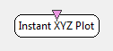

.. _Doc_BoxAlgorithm_InstantXYZPlot:

Instant XYZ Plot
================

.. container:: attribution

   :Author:
      Yann Renard
   :Company:
      Mensia Technologies SA

The *Instant XYZ Plot* displays temporal numerical data in a 2D (*resp.* 3D) space, consecutive rows of the input matrix being grouped by 2 (*resp.* 3) to form the 2D (*resp.* 3D) trajectories.
The display is done **instantly**, meaning that whenever a new data block arrives, it is displayed in the visualization windows, without previous trajectories. Moreover, colors change as a function of time (samples order).

The *Instant XYZ Plot* box shares common concepts and settings with the other boxes in the **Mensia Advanced Visualization Toolset**.
Additional information are available in the dedicated documentation pages:

- :ref:`Doc_Mensia_AdvViz_Concepts`
- :ref:`Doc_Mensia_AdvViz_Configuration`

Inputs
------

.. csv-table::
   :header: "Input Name", "Stream Type"

   "Matrix", "Signal"

Matrix
~~~~~~

The input can be a streamed matrix or any derived stream (Signal, Spectrum, Feature Vector).
Please set the input type according to the actual stream type connected.

.. _Doc_BoxAlgorithm_InstantXYZPlot_Settings:

Settings
--------

.. csv-table::
   :header: "Setting Name", "Type", "Default Value"

   "Gain", "Float", "1"
   "Caption", "String", ""
   "Translucency", "Float", "1"
   "Show Axis", "Boolean", "true"
   "Use third channel as depth", "Boolean", "false"
   "Color", "Color Gradient", "${AdvancedViz_DefaultColorGradient}"

Gain
~~~~

Gain (floating-point scalar factor) to apply to the input values before display.

Caption
~~~~~~~

Label to be displayed on top of the visualization window.

Translucency
~~~~~~~~~~~~

This setting expect a value between 0 and 1, from transparent to opaque color rendering (nb: this value is the alpha component of the color).

Show Axis
~~~~~~~~~

If this checkbox is ticked, the axis and the grid are displayed.

Use third channel as depth
~~~~~~~~~~~~~~~~~~~~~~~~~~

If this checkbox is ticked, trajectories are plotted in a 3D space, otherwise in a 2D space.

Color
~~~~~

Color gradient to use. This setting can be set manually using the color gradient editor.
Several presets exist in form of configuration tokens ``${AdvancedViz_ColorGradient_X}``, where X can be:

- ``Matlab`` or ``Matlab_Discrete``
- ``Icon`` or ``Icon_Discrete``
- ``Elan`` or ``Elan_Discrete``
- ``Fire`` or ``Fire_Discrete``
- ``IceAndFire`` or ``IceAndFire_Discrete``

The default values ``AdvancedViz_DefaultColorGradient`` or ``AdvancedViz_DefaultColorGradient_Discrete`` are equal to </t>Matlab</tt> and ``Matlab_Discrete``.

.. _Doc_BoxAlgorithm_InstantXYZPlot_VizSettings:

Visualization Settings
----------------------

At runtime, all the advanced visualization shared settings are exposed, as described in :ref:`Doc_Mensia_AdvViz_Configuration_RuntimeToolbar`.

