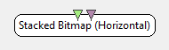

.. _Doc_BoxAlgorithm_StackedBitmapHorizontal:

Stacked Bitmap (Horizontal)
===========================

.. container:: attribution

   :Author:
      Yann Renard
   :Company:
      Mensia Technologies SA

The *Stacked Bitmap (Horizontal)* box displays input data in form of 2D maps of colored blocks (or *bitmap*).
All the bitmaps are stacked horizontally, starting from the left edge of the window.
Whenever a new data block arrives, it is added to the visualization windows. If the end of the matrix count scale is reached, it goes back to the origin.
The bitmap colors are chosen according to a custom gradient.

The *Stacked Bitmap (Horizontal)* box shares common concepts and settings with the other boxes of the **Mensia Advanced Visualization Toolset**.
Additional information are available in the dedicated documentation pages:

- :ref:`Doc_Mensia_AdvViz_Concepts`
- :ref:`Doc_Mensia_AdvViz_Configuration`

Inputs
------

.. csv-table::
   :header: "Input Name", "Stream Type"

   "Matrix", "Streamed matrix"
   "Markers", "Stimulations"

Matrix
~~~~~~

The first input can be a streamed matrix or any derived stream (Signal, Spectrum, Feature Vector).
Please set the input type according to the actual stream type connected.

Markers
~~~~~~~

The second input expect stimulations. They will be displayed as **colored vertical lines**.

.. _Doc_BoxAlgorithm_StackedBitmapHorizontal_Settings:

Settings
--------

.. csv-table::
   :header: "Setting Name", "Type", "Default Value"

   "Channel Localisation", "Filename", "${AdvancedViz_ChannelLocalisation}"
   "Temporal Coherence", "Temporal Coherence", "Time Locked"
   "Time Scale", "Float", "20"
   "Matrix Count", "Integer", "50"
   "Gain", "Float", "1"
   "Caption", "String", ""
   "Color", "Color Gradient", "${AdvancedViz_DefaultColorGradient}"

Channel Localisation
~~~~~~~~~~~~~~~~~~~~

The channel localisation file containing the cartesian coordinates of the electrodes to be displayed.
A default configuration file is provided, and its path stored in the configuration token ``${AdvancedViz_ChannelLocalisation}``.

Temporal Coherence
~~~~~~~~~~~~~~~~~~

Select *Time Locked* for a continuous data stream, and specify the *time scale* below.
Select *Independent* for a discontinuous data stream, and specify the *matrix count* below.

Time Scale
~~~~~~~~~~

The time scale in seconds, before the displays goes back to the origin.

Matrix Count
~~~~~~~~~~~~

The number of input matrices to receive before the displays goes back to the origin.

Gain
~~~~

Gain (floating-point scalar factor) to apply to the input values before display.

Caption
~~~~~~~

Label to be displayed on top of the visualization window.

Color
~~~~~

Color gradient to use. This setting can be set manually using the color gradient editor.
Several presets exist in form of configuration tokens ``${AdvancedViz_ColorGradient_X}``, where X can be:

- ``Matlab`` or ``Matlab_Discrete``
- ``Icon`` or ``Icon_Discrete``
- ``Elan`` or ``Elan_Discrete``
- ``Fire`` or ``Fire_Discrete``
- ``IceAndFire`` or ``IceAndFire_Discrete``

The default values ``AdvancedViz_DefaultColorGradient`` or ``AdvancedViz_DefaultColorGradient_Discrete`` are equal to </t>Matlab</tt> and ``Matlab_Discrete``.

An example of topography rendering using these color gradients can be found :ref:`Doc_Mensia_AdvViz_Configuration` "here".

.. _Doc_BoxAlgorithm_StackedBitmapHorizontal_VizSettings:

Visualization Settings
----------------------

At runtime, all the advanced visualization shared settings are exposed, as described in :ref:`Doc_Mensia_AdvViz_Configuration_RuntimeToolbar`.

.. _Doc_BoxAlgorithm_StackedBitmapHorizontal_Examples:

Examples
--------

In the following example, we compute the FFT of every right-hand trial in a Motor Imagery session, filtered spatially around the two motor cortices.
All the spectra are stacked on top of each other.

You can find a commented scenario in the provided sample set, the scenario file name is \textit{StackedBitmapHorz.xml}.

.. figure:: images/StackedBitmapHorz_Example.png
   :alt: Example of scenario using the Stacked Bitmap (Horizontal)
   :align: center

   Example of scenario using the Stacked Bitmap (Horizontal)

