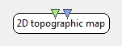

.. _Doc_BoxAlgorithm_2DTopographicMap:

2D topographic map
==================

.. container:: attribution

   :Author:
      Vincent Delannoy
   :Company:
      INRIA/IRISA

The 2D Topographic Map plugin is one possible way to combine signal measures and topographical information. It interpolates measured potentials
and maps them over the scalp surface using a color scale, making it easy to locate areas where brain activity is the most intense at any given time.

Since this is a 2D plugin, one cannot freely move the camera around the head. However, the user may switch between several views which, 
when combined, cover the whole of the skull area over which potentials may be mapped.

This plugin uses a spherical spline algorithm to interpolate potentials measured at electrode locations over an area of interest (which varies depending on the active view).
One can choose to interpolate potentials (which is done by interpolating along a spline whose control points lie at electrode locations) or current densities (which are
computed using the spline laplacian).

Inputs
------

.. csv-table::
   :header: "Input Name", "Stream Type"

   "Signal", "Streamed matrix"
   "Channel localization", "Channel localisation"

Note: the channel names specified on the 'Signal' and 'Channel Localization' input streams should match. Mismatches may not be reported by the box. For example, if electrode localisation file reader provides the positions of the electrodes from some configuration file, the channel names in that file should correspend to the names of the signal channels delivered in the Signal stream.

.. _Doc_BoxAlgorithm_2DTopographicMap_Settings:

Settings
--------

.. csv-table::
   :header: "Setting Name", "Type", "Default Value"

   "Interpolation type", "Spherical linear interpolation type", "1"
   "Delay (in s)", "Float", "0"

Offline options include interpolation type (direct spline interpolation for potentials, or spline laplacian to map currents) and delay applied when mapping data (0 by default). The latter
can prove useful in the case of e.g. neurofeedback experiments. Indeed, subjects may find it easier to observe their mental activity and the effect mental tasks can have on it
when it is displayed with a small delay (on the order of a few hundreds of milliseconds).

Interpolation type
~~~~~~~~~~~~~~~~~~

Spline or laplacian interpolation.

Delay (in s)
~~~~~~~~~~~~

Delay to apply to displayed data, in seconds

.. _Doc_BoxAlgorithm_2DTopographicMap_VizSettings:

Visualization Settings
----------------------

Online options include :

- Radial/Axial Projection : these settings control the projection mode. Radial projection displays a greater mapping area, but localisation is less intuitive than

with axial projection.

- Map Potentials/Currents : these settings control the nature of mapped values. While potentials are computed from spline values, currents computation uses the spline laplacian.
- Toggle Electrodes : toggle electrodes on/off.
- Top/Left/Right/Back View : these buttons enable view switching.
- Delay : this cursor defines the delay to apply to the values that are drawn.

.. figure:: images/topographicmap2ddisplay_toolbar.png
   :alt: 2D Topographic Map toolbar.
   :align: center

   2D Topographic Map toolbar.

.. _Doc_BoxAlgorithm_2DTopographicMap_Examples:

Examples
--------

Practical example :

This example is based on the following scenario file : 

.. code::

   box-tutorials/topographic_map.xml

To see this plugin in action, one should first locate a file corresponding to a prerecorded EEG or MEG session and play it back using e. g. a GDF file reader or some other suitable plugin.
The GDF file used by default in this scenario is the following : 

.. code::

   signals/real-hand-movements.gdf

Signal data read by this box can be forwarded to the 2D Topographic Map plugin, which has a single input connector. However, interpolating unprocessed data will not deliver very meaningful
results. To make it easier to analyse, one can restrict signals to a frequency band of interest. Also, it can be desirable to average out signals using DSPs (a typical formula
consists in visualising log(1+X\*X) where X represents incoming signals) and epoch average boxes. This should result in smoothed out signals where peak activity areas will move gradually
between frames, thus making them easily identifiable on the map.

Let's use a temporal filter box (found under 'Signal Processing > Filters') to restrict incoming signals to a frequency band of our choice, e.g. the Beta range, about 16-24 Hz.
Appropriate settings could go like this : 'Butterworth' filter type, 'Band Pass' filtering, 16Hz low pass band edge, 24Hz high pass band edge).

Next, one can average out signals by applying the typical log(1+X\*X) formula. A 'Simple DSP' (found under 'Signal Processing > Basic') can compute the square of the signal ('Equation'
should read 'X\*X'), its output is averaged using a Signal Average box (found under 'Signal Processing > Basic'), and the decimal log of its output is obtained using another
Simple DSP box (formula : 'log(X)')).

Finally, once data has been restricted to a given frequency band and averaged out, it can be further smoothed out in time using an Epoch Average box ('Signal Processing > Averaging').
This allows to average data over a number of epochs. re information.

Here is what an EEG recording may look like using the scenario that was just described :

.. figure:: images/topographicmap2ddisplay_online.png
   :alt: Top view mapping of potentials interpolated from 9 EEG electrodes.
   :align: center

   Top view mapping of potentials interpolated from 9 EEG electrodes.

