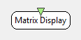

.. _Doc_BoxAlgorithm_MatrixDisplay:

Matrix Display
==============

.. container:: attribution

   :Author:
      Laurent Bonnet
   :Company:
      INRIA/IRISA

The streamed matrix can be visualized using a table of values and/or a color gradient.

This box displays an input matrix in a table of gradient-colored squares. 
**WARNING : The color gradient is centered (50%) at the value 0.**
The limits of colors match the minimum and maximum values, ever received or in real time if the corresponding setting is set.
These values can evolve symmetrically, using the maximum absolute value.

Inputs
------

.. csv-table::
   :header: "Input Name", "Stream Type"

   "Matrix", "Streamed matrix"

Matrix
~~~~~~

The matrix to display.

.. _Doc_BoxAlgorithm_MatrixDisplay_Settings:

Settings
--------

.. csv-table::
   :header: "Setting Name", "Type", "Default Value"

   "Color gradient", "Color Gradient", "0:2,36,58; 50:100,100,100; 100:83,17,20"
   "Steps", "Integer", "100"
   "Symetric min/max", "Boolean", "false"
   "Real time min/max", "Boolean", "false"

Color gradient
~~~~~~~~~~~~~~

The color gradient used.

Steps
~~~~~

The number of color steps used in the gradient. The more you have steps, the smoother the gradient will be .

Symetric min/max
~~~~~~~~~~~~~~~~

This parameter determines if the minimum and maximum values, matching the 0% and 100% color in the gradient, 
should change symmetrically using the maximum absolute value and its opposite.

Real time min/max
~~~~~~~~~~~~~~~~~

This parameter determines if the minimum and maximum values, matching the 0% and 100% color in the gradient, 
should be recomputed for each matrix received. 

.. _Doc_BoxAlgorithm_MatrixDisplay_VizSettings:

Visualization Settings
----------------------

Online settings :

- Setting1 : Show/hide values
- Setting2 : Show/hide colors

.. _Doc_BoxAlgorithm_MatrixDisplay_Examples:

Examples
--------

Here is an example using a :ref:`Doc_BoxAlgorithm_ConfusionMatrix` box that computes confusion matrix from classifier results.

.. figure:: images/matrix_display_online.png
   :alt: Confusion matrix displayed using the Matrix Display
   :align: center

   Confusion matrix displayed using the Matrix Display

