# Interface Overview {#designer-interface}

\page DesignerInterface Interface

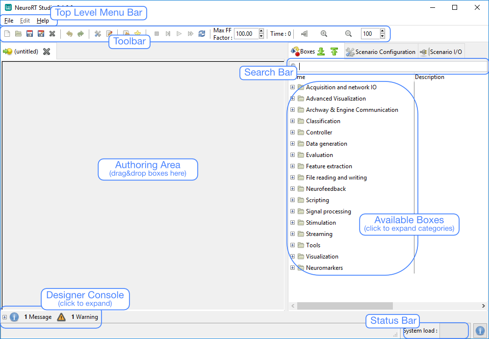  
OpenViBE Designer Interface

The following sections are an overview of the main features of Designer tool, and make for a quick and easy introduction to its usage. Here are the topics covered in this overview:

- Top Level **Menu Bar**
- **Toolbar**, which provides immediate access to the most common actions (Scenario File Edition, Window Manager, Active Logs Level, Add Comment Box, Edit Scenario Information, Scenario Control, …)
- **Available Boxes** tree view
  - **Scenario Settings**
  - **Scenario I/O Controls**
- **Status Bar**, which provides performance information when a scenario is being run
- **Message Console** which prints Info, Warning or Error messages
- **Scenario Authoring** window, where boxes may be arranged together in order to fulfill the task at hand.
- Custom Tools

## Menu Bar

Options available from the menu bar are presently restricted to actions involving handling and exiting the application. Scenarios can be saved to MXS (Mensia XML Scenario) or to XML files (as does OpenViBE). Several scenarios may be edited simultaneously, and the active scenario may be changed by clicking onto the corresponding tab at the top of the scenario editor window. Here is a list of options from the menu bar and their shortcuts if available:

The File menu handles standard scenario operations such as creation, saving and closing. Note that the application won't quit as long as at least one scenario is running.

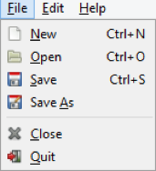

- New – **Ctrl+n**: open a new scenario in a new tab:
- Open – **Ctrl+o**: open a file selection dialog to select an existing scenario file
- Recent Scenarios: access recently closed scenarios
- Save – **Ctrl+s**: save current scenario
- Save As: save the current scenario in another file
- Close - **Ctrl+w**: close current scenario tab
- Quit – **Alt+F4**: quit Designer

The Edit menu allows the user to cut/copy/paste selections (in a scenario or across scenarios). These options can also be accessed when right-clicking on a box. User actions are saved during scenario editing and can be retrieved through undo-redo.

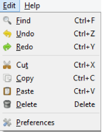

- Find – **Ctrl+f**: direct to filter box to make a search in the list of boxes
- Undo – **Ctrl+z**: cancel the last edition operation
- Redo – **Ctrl+y**: redo the operation you just cancelled
- Cut – **Ctrl+x**: cut current selection
- Copy – **Ctrl+c**: copy current selection
- Paste – **Ctrl+v**: paste current selection
- Delete – **Del**: delete current selection
- Preferences: this item displays the Configuration Manager dialog. It contains a list of all configuration tokens and their values. This list is read only. To know more about the Configuration Manager, refer to The Configuration Manager documentation paragraph.

The Help menu allows the user to open some various utilities applications.

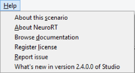

- About this scenario – allow to add a scenario description see: Adding metadata
- About OpenViBE – display Credits for Designer
- Browse documentation – Open box documentation
- Register License – Open tool to add a license
- Report issue – Open the support website, see: Support
- What's new in version 3.0.x.x of Designer

## Toolbar

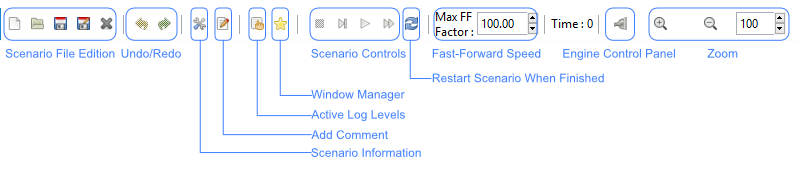  
NeuorRT Designer Toolbar

The first section of the tools bar offers direct access to the scenario handling options that you can find in the menu *File*.

Next section contains the Undo and Redo buttons.

After these you have controls for various functionalities of OpenViBE Designer:

## Window Manager

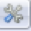  

The **Window Manager** button is a toggle button, allowing for displaying and hiding the **window manager**. This tool is displayed in a popup window when the button is pressed. It takes care of arranging visualization boxes in a layout. Such boxes (if any in the current scenario) initially appear under the 'Unaffected display plugins' node of the tree view in the upper left corner. A window containing one tab is also created by default and displayed on the right, as below:

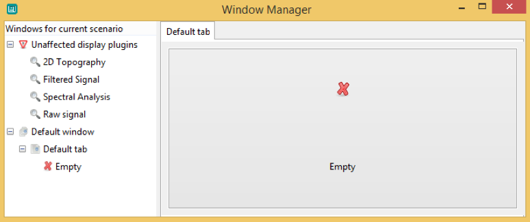  
Window manager popup dialog for a scenario with 4 visualization boxes, by default

Users may create any number of windows containing any number of tabs, and then drag and drop visualization boxes onto such tabs in a tree-like structure. If the user chooses to not use the window manager all visualization boxes will be given their own window, displayed when the scenario is being played. For a more in-depth review of the window manager usage, see the Window Manager Tutorial.

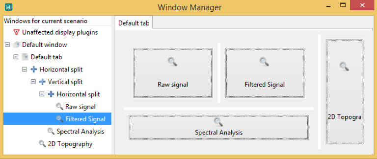  
Window manager popup dialog for a scenario with 4 organized visualization boxes

## Log Levels

  

The second button displays the log levels dialog (   ). It may be used to configure which log messages should be displayed in the console. It contains 8 levels as shown in the following figure:

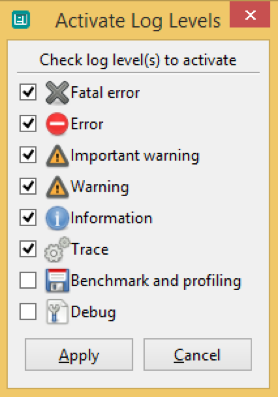  
Log Levels Dialog

*Warnings* and *Errors* should always be selected. *Information* displays useful messages from signal processing boxes. *Trace* can be used to check step-by-step the processing in the boxes and the kernel. *Benchmark* and *Debug* are very verbose and should not be used with Designer console (only in log files).

## Scenario Comments

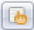

This button adds a dedicated comment box to the scenario. These boxes have of course no input and outputs. Double click on them to edit the comment they display. The syntax of the comments uses `pango style <http://www.gtk.org/api/2.6/pango/PangoMarkupFormat.html>`__, the style buttons can help you format your comment.

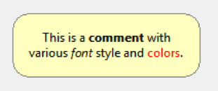  
Comment, as it appears in a scenario

  
Comment Editor Dialog

## Scenario Description

This buttons allows editing of some information that will be saved with the scenario (name, authors, date, description, etc.).

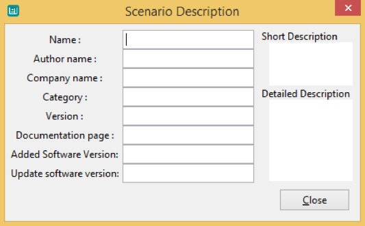  
Scenario Description

## Scenario Controls

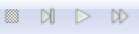

Scenario controls work like a media player would.

- Stop – **F5**: go back to scenario edition mode
- Step – **F6**: play scenario one step of simulation at a time
- Play/Pause – **F7**: play scenario in real time or pause it if it is already running
- Fast Forward – **F8**: play scenario as fast as possible
  
Once a scenario is being played, it is not possible to modify it. Press *Stop* to go back in edition mode. Shortcuts from F5 to F8 can be used only if the focus is on Designer main window (not on visualization windows for example).

Finally, the toolbar contains a time counter which displays the simulation time as a scenario is being run. It is reset to 0 as a scenario is stopped.

## Box Algorithms Tree View

The right-hand part of Designer window displays a list of existing box algorithms, which are the building blocks of OpenViBE scenarios.

Under the *Box algorithms* tab lies a tree view listing available box algorithms, along with a short description of their respective roles. Box algorithms are the smallest granular elements that may be manipulated by a Designer user. They act as black boxes which can be connected together by their inputs and outputs. In order to facilitate their selection, they are grouped into categories, which make up the top level nodes of the tree view. Some categories are related to signal processing, others to scenario serialization or visualization purposes. The default tree view shows only stable and fully supported boxes.

The status of a box varies with the context, and is reflected by the color of the font used in the tree view. The box name and description will use a cyan font if the box is deprecated, and a light grey font if it is unstable. To know more about box status, see section Box status.

## Status Bar

The status bar that lies at the bottom of the window provides performance information. When a scenario is being run, OpenViBE keeps track of the time used by each box and of the overall execution time. Overall performance is displayed in a green gauge overlaid with the same information in percent. A system load 100 percent means the system is barely able to handle the computation load induced by the scenario to run in real-time.

To identify the bottlenecks in a scenario, one can press the button to the right of the gauge as a scenario is being run. This will highlight boxes from green to red, depending on how much time is spent in each box relative to the others.

## Console

Designer console can be expanded/hidden by a simple click. You can choose the log levels you want to see in this particular window. Designer console has been developed in order to be sure to see any warning or error messages.

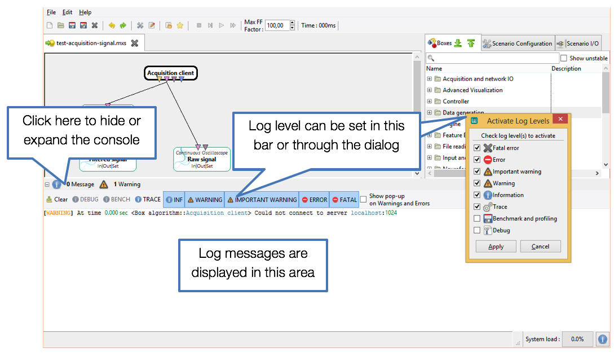  
OpenViBE Designer Console
