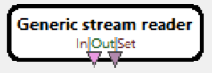
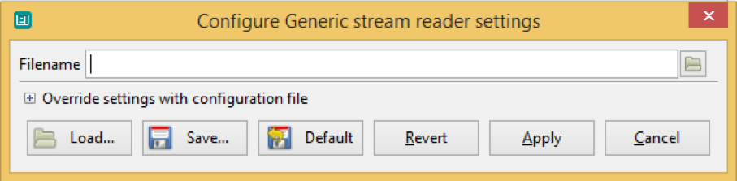
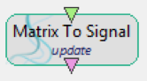
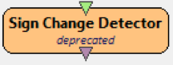
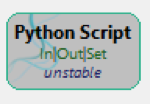
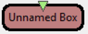
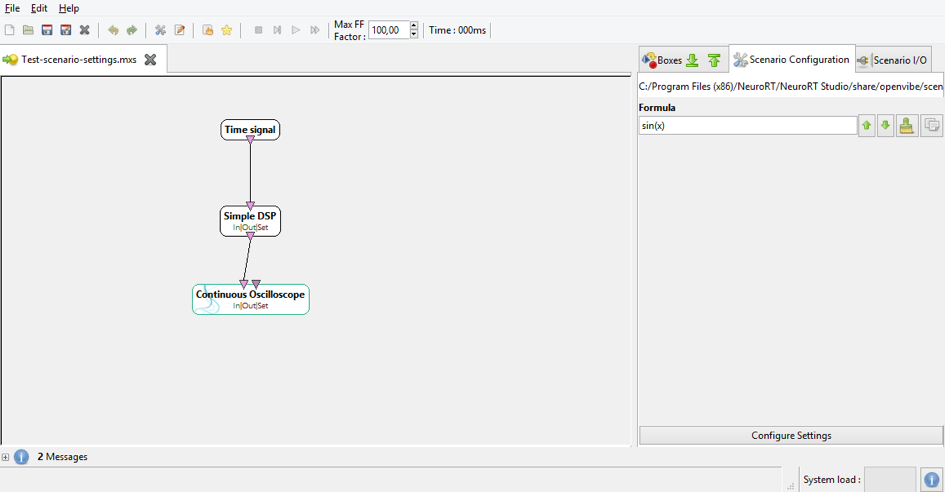
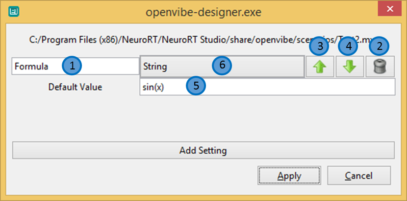
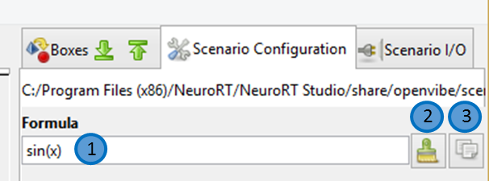
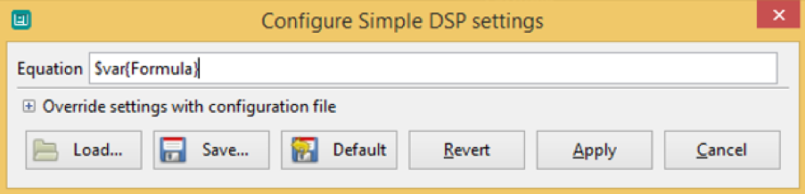

# Authoring Scenarios {#designer-authoring-scenarios}

\page DesignerAuthoringScenarios Authoring Scenarios

This section covers the working area of Designer, which is where OpenViBE scenarios are assembled by connecting box algorithms together.

## Boxes

Box algorithms are added to the active scenario by drag and dropping them from the tree view to the scenario edition window. They appear as rounded rectangles with their name inside the box, inputs (if any) on top and outputs (if any) at the bottom. These connectors are displayed as color-coded triangles. Colors vary with the connector type, and help users to make sure they connect boxes properly. See *Connector Types* for an overview of the different connector types and hierarchy.

  
A file reading box algorithm which has 2 outputs (signal and stimulations streams)

Additionally, if the box has **customizable settings**, they may be set by double clicking on the box (*tip*: when a box has such settings, its name is displayed in bold). The settings are listed in the popup dialog that appears, along with their default values. Settings may be overridden by directly typing in their desired values, or they may be read from a file. In the latter case, one should expand the *Override settings with configuration file* section to check the *File* button and pick a configuration file.

  
Settings of a 'Generic stream reader' box: filename text entry

### Linking Boxes

The output of a box can be linked to the input of another box if the type of the output is the same type or is a derived type of the input's type. For example, a Signal output can be connected on a Streamed Matrix input as Signal's type derives from Streamed Matrix.

The various stream types are:

- [▼]{.color-stream-unidentified} Unidentified Stream
- [▼]{.color-stream-if-else} If/Else Condition Controller
- [▼]{.color-stream-ebml} EBML Stream
  - [▼]{.color-stream-experiment-information} Experiment Information
  - [▼]{.color-stream-stimulations} Stimulations
  - [▼]{.color-stream-streamed-matrix} Streamed Matrix
  - [▼]{.color-stream-covariance-matrix} Covariance Matrix
  - [▼]{.color-stream-channel-localization} Channel Localization
  - [▼]{.color-stream-feature-vector} Feature Vector
  - [▼]{.color-stream-signal} Signal
  - [▼]{.color-stream-spectrum} Spectrum
  - [▼]{.color-stream-time-frequency} Time/Frequency

There are different connector types differentiated by their color, see figure above. The type "Unidentified stream" is applied on a connector type that couldn't be identified in the launched version of Designer. Some boxes that can have different connector types may also have this type of connectors by default. The type *If / Else Condition Controller* is a special type that is useful in the boxes: *If / Else Separation* and *End If / Else Concatenation*. See the documentation of these boxes for more details.

### Box Status

By default, the status of a box is 'normal', and the box is drawn with a white background. However, some boxes may have a different status depending on the situation. Here are the other possible status of a box:

#### **Update**

When a box is not up to date with the latest version used in a given distribution of OpenViBE, it is drawn as this "Matrix to Signal" box. This situation arises when the prototype of a box has changed between the time the scenario it is stored in is saved and the time it is loaded again. Since scenario files contain information about box prototypes, such as the number of connectors, they may need to be updated when the OpenViBE distribution used to manipulate scenarios changes. To update such a box, simply delete the box from the scenario then add it again. The new box will use the latest version.

Tip: after such an update, one should make sure to reconfigure the box settings if needed!

#### **Deprecated**

As OpenViBE evolves with time, some boxes are added to the platform and others are deleted. It can also happen that a box is replaced with another one (maybe for performance reasons). However, the 'old' box is not necessarily deleted from the platform, but may be kept for backward compatibility with older versions (ensuring older scenarios may still be run, for example). In that case, the documentation should mention that from that time on, the new box should be preferred over the deprecated one (which may be removed from the platform at any time, and in any case which probably won't be maintained anymore). Such boxes are displayed with an orange background and the 'deprecated' label below the box name.

#### **Unstable**

A box which is under development should be flagged as 'unstable', meaning it may have only been partially implemented or tested. Consequently, it may not behave properly in all conditions, or may be updated in a future release. Such a box is drawn with a dark grey background in Designer, and the 'unstable' label appears below the box name.

#### **Missing**

A box that was described in a scenario but is not present in the opened version of Designer is considered as missing and its background is drawn in red color. This means that the launched version of Designer cannot find the information regarding this box and thus cannot play it.
Note that the default tree view shows only stable and fully supported boxes. To use "unstable" boxes set Designer_ShowUnstable to TRUE or tick the corresponding box on top of the tree view. As stated in their documentation pages, unstable boxes can have unexpected behaviors.

### Box Manipulation

All box algorithms may be configured in Designer. However, not all boxes offer the same configuration options. In this overview, we'll focus on functionalities that are common to all boxes. More advanced possibilities are detailed in another tutorial (Tutorial 3: Advanced box configuration).

To illustrate box editing functionalities, let's start by creating a new scenario, and drop a couple of boxes from the box algorithms tab. Simple boxes such as *Time Signal* and (found under the 'Data Generation' category) will do for this tutorial. Drag and drop these boxes in the scenario working area, then right-click on the *Time Signal* box. A context menu should appear, listing different editing functionalities.

Box editing functionalities appear in the lower part of the menu:

- **Rename box (F2)** allows to rename the box. Click this option and enter a new name such as 'Dummy Box' to test this functionality.
- **Delete box (Del)** removes this box from the scenario. Note that a box may also be deleted by selecting it, then pressing the 'Delete' key.
- **About box** displays a dialog containing a summary of the box details, such as its author, version, the version of Designer in which the box was added and last updated, the class name, as well as a short and long description of its purpose. Note that the 'short description' field also appears in the second column of the box algorithms tab.

Another option only gets listed for those boxes that offer configurable settings, such as the *Time Signal* box (this is indicated from its name displayed in bold case). Right click on this box and select:

- **Configure box**, which displays the Box Settings dialog. Note that this dialog may also be displayed by double clicking on the box itself.

## Scenario Manipulation

Standard cut/copy/paste functionalities are supported in Designer. Select a box and right click on it to display a menu from which to select these options.

Groups of boxes may be edited in the same way. Select several boxes at once by maintaining the **Ctrl** key pressed then clicking on the boxes you want to cut or copy. You may also draw a selection area by left clicking in the scenario editing area then drawing a selection rectangle while keeping the button pressed. **Ctrl+A** selects everything in the scenario.

Cut/copy your selection by right clicking on it then selecting the corresponding entry, or by pressing **Ctrl+X/Ctrl+C**.

Paste your selection by right clicking anywhere in the edition area, or pressing **Ctrl+V**. Note that you may also paste selections from one scenario to another.

Delete your selection by selecting 'Delete boxes' in the contextual menu, or pressing the **Delete** key.

Finally, the origin of the scenario editing area may be changed by pressing and holding the Shift key and left click then moving the mouse as desired. This allows you to explore your scenario window without using the scrolling bars.

## Scenario Settings

Scenarios, much like boxes, can have their own settings. To access the settings of a scenario click on the **Scenario Configuration** tab in the right pane.

  
Scenario Configuration Pane

### Adding Settings

To add a setting to the current scenario, press the **Configure Settings** button. A new window will appear. In it you are able to modify all settings the currently open scenario has.

Adding a setting is similar to adding a setting to a box. You can use all available types as well.

Once you add a setting it will appear in the list. There are several actions you can do on a setting.

  
Scenario Settings Configuration Dialog

1. Rename setting
2. Delete setting
3. Move setting up
4. Move setting down
5. Change default setting's value
6. Change setting's type

When you close the setting configuration dialog box, your new settings will appear in the Scenario Configuration pane.

### Modifying Settings

You can change the setting’s value inside the tab **Scenario Configuration**.

  
Scenario Configuration with Settings

1. Modify the settings value
2. Reset setting to its default value
3. Copy the current setting identifier wrapped in `$var{}` (explained in next step)

### Using Settings

Scenario Settings can be used in place of any setting of a box. In order to do so, right-click on the box, then click on configure box option and simply change the setting inside that box to a token named after the Scenario Setting wrapped inside a `$var{}` token.

In our example for DSP:

  
Using scenario settings

In order to simplify the process there is a convenience button that copies the whole string for a particular setting (Button labelled 3 in previous paragraph).
