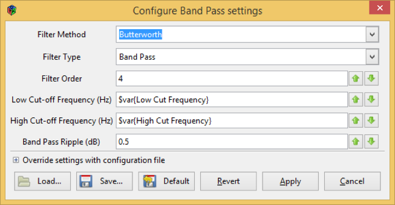
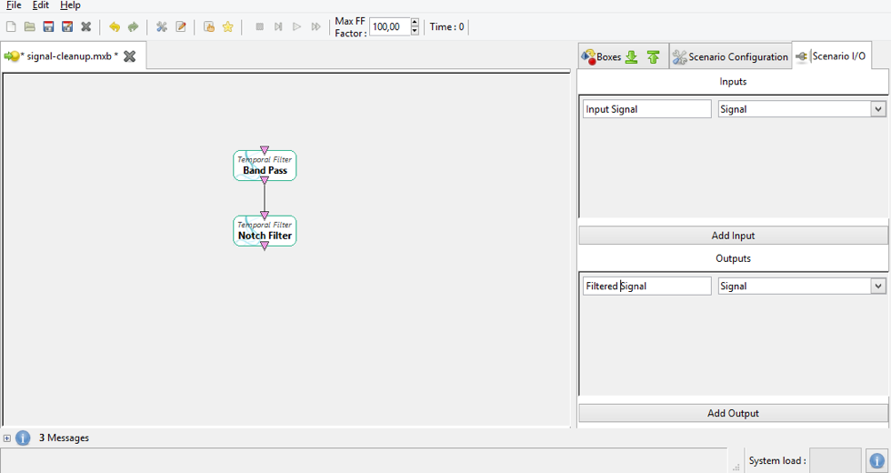
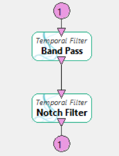
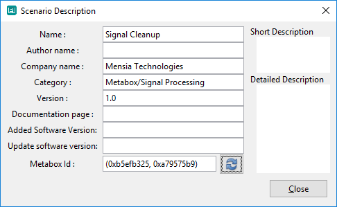
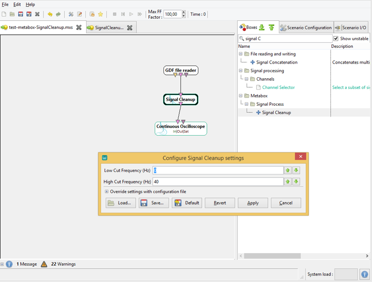

# Metaboxes {#designer-metaboxes}

\page DesignerMetaboxes Metaboxes

In OpenViBE Designer you can create new boxes by assembling them from parts of other boxes, they are called metaboxes. This section describes their usage. Metaboxes are loaded on start-up of the OpenViBE Designer. They are loaded from the directories `$InstallDir/share/openvibe/metaboxes` and `%APPDATA%/mensia/metaboxes`. These metaboxes are written under the formats `.mxb` or `.mbb`.

A Metabox behaves just like a normal box, that is:

- It has an arbitrary number of inputs and outputs using the same types as other boxes.
- It can have an arbitrary number of settings.
- It can be inserted into a scenario.
- It can have visualizations.

## Creating Metaboxes

In order to create a Metabox you first have to create a scenario.

Example: we want to make a Metabox that will apply a notch filter for 48-52Hz and then apply an arbitrary band-pass filter on the signal.

Thus, our Metabox consists of:

- One Signal input
- One Signal output
- Two temporal filter boxes
- Two settings
  - Lower frequency bound
  - Upper frequency bound

### Step 1: Adding boxes and settings

We create a new empty scenario and add two settings to it, we also drag two temporal filter boxes inside and set them up like so:

  
Creating a metabox - step 1

First Temporal filter box is renamed Band Pass, the second one is renamed Notch filter (right-click + rename box: Notch Filter).

We set the notch filter to a band stop filter with cut off frequencies at 48 and 52Hz.

### Step 2: Adding inputs and outputs

In order to "expose" inputs and outputs of our metabox we need to add some inputs and outputs to a scenario.

To do so we use the Scenario I/O tab. To add an input or output simply click the appropriate add button. A setting has only a name and a type. By default, the created type is Streamed Matrix.

- Add one **input** to the scenario, change its type to **Signal** and rename it to **Input Signal**
- Add one **output** to the scenario, change its type to **Signal** and rename it to **Filtered Signal**

  
Adding inputs and outputs

In order to associate a scenario input with a box input, right click on the box you wish to send the input to. A new context menu item will be available: **Connect scenario inputs**. In this context menu item will be a list of all box inputs which will again open a list of all scenario inputs. Clicking on the scenario input will link the box input to the scenario input.

Right click on the **Notch filter** box. In the **connect scenario inputs** submenu you will see the single input of the box. Incidentally it is also called *Input Signal*, under this item there will be another item called *Input Signal* – this is our scenario’s input.

  
Linking a scenario input

Now do the same for the output. A circular indicator will be displayed to represent the link between the scenario input and the box input.

  
Linked inputs and outputs

Each scenario input can be linked to exactly one box input. If you wish to use the same input in several boxes, use an identity box.

### Step 3: Adding Metadata

The metabox reads its metadata from the scenario information. You can edit it by clicking on the star button in the toolbar.

The most important attributes are **Name**, **Category** and **Metabox Id**. This is how your box will be identified inside the box-algorithm list.

The **Metabox Id** serves as a unique identifier for this box. You can either specify it yourself (as a group of two 32bit hex integers) or use the refresh button to generate one.

Save your box inside the `%APPDATA%/mensia/metaboxes` folder.

  
Change about scenario

## Using a Metabox

Metaboxes will appear in the sidebar just like the other boxes, except they are highlighted in a green colour.

You can drag a metabox into the scenario as you would any other box. It will appear with a double border.

  
Metabox in scenario

Double clicking on the metabox will reveal all of the settings of the scenario that represents the metabox. You can also right click on a metabox and open it in editor from the context menu *Edit this metabox in the editor*.
