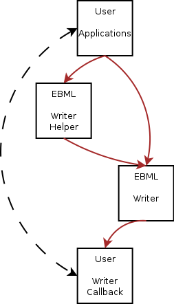
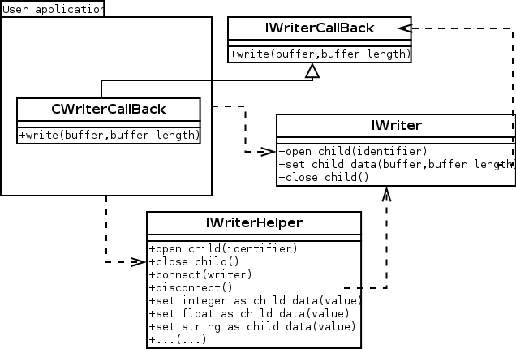

# Formating EBML streams {#formating-ebml}

\page FormatingEBML Formating EBML streams

## Introduction

This page tries to teach how a user of this library should use the writing functions in order to build and format an EBML stream correctly. For those who don't know what EBML is, it is basically a binary XML created and used by the matroska developpers. The libmatroska is based on the libebml implementation of these guys. Fore more details, please read  the [What Is EBML](_what_is_e_b_m_l.html) page first and eventually visit the  EBML web page at <http://ebml.sourceforge.net/>

## Concepts

The idea of this formating library is to transform the data provided by the user application into EBML buffers. Those EBML buffers are then given to a user callback object which know what to do with the computed data (maybe write it to a file, send it on a socket, log it in a console, whatever...)

The library is divided into three main components :

- The writer itself that does the formating stuff
- An implementation of the callback object (the implementation is left to the user application developper)
- An optionnal helper object that knows more on the content of the EBML stream.

Here comes the organisation of the different modules and how data go from one to another. Note that the user application and the user callback object may share some information so the callback object communicates with the application itself.



Here comes the UML class diagram, presenting the main classes involved in the presented behavior.



See EBML::IWriter, EBML::IWriterCallback and EBML::IWriterHelper for more details on each of these classes.

## Sample code

In this section, a sample of user application code is presented that opens several child nodes and dumps the created stream into a file for later use. This file can be parsed using the sample code of the page named [Parsing EBML Streams](_parsing_e_b_m_l.html)

The callback object implementation looks something like this :

```cpp
class CWriterCallback : public EBML::IWriterCallback
{
public:
  CWriterCallback(char* filename) { m_file=fopen(filename, "wb"); }
  virtual ~CWriterCallback() { if(m_file) fclose(m_file); }
  virtual void write(const void* buffer, const size_t size) { if(m_file) fwrite(buffer, size, 1, m_file); }
  FILE* m_file;
};
```

Then in the user application code, we can write the
initialisation this way :

```cpp
CWriterCallback oCallback("test.ebml");
EBML::IWriter* writer=EBML::createWriter(oCallback);
EBML::IWriterHelper* writerHelper=EBML::createWriterHelper();
writerHelper->connect(writer);
```

The use of the EBML writer looks something like this :

```cpp
writerHelper->openChild(EBML_Identifier_Header);
writerHelper->openChild(EBML_Identifier_DocType);
writerHelper->setStr("EBML basic sample");
writerHelper->closeChild();
writerHelper->openChild(EBML_Identifier_DocTypeVersion);
writerHelper->setUInt(1);
writerHelper->closeChild();
writerHelper->closeChild();
```

Finally, we have to release the objects and to clean memory :

```cpp
writerHelper->disconnect();
writerHelper->release();
writer->release();
```
