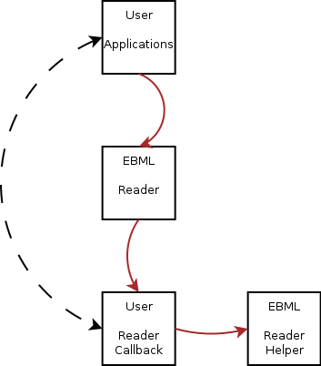
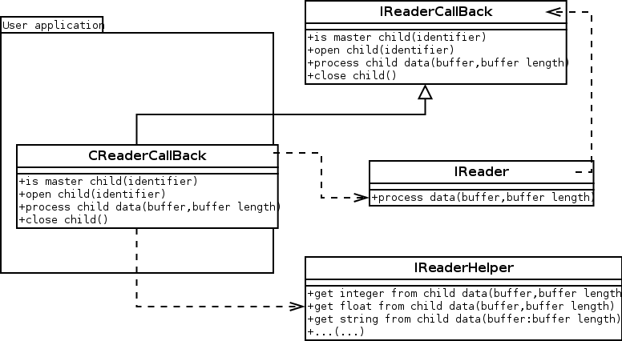

# Parsing EBML streams {#parsing-ebml}

\page ParsingEBML Parsing EBML streams

## Introduction

This page tries to teach how a user of this library should use the reading functions in order to read and parse an EBML stream correctly. For those who don't know what EBML is, it is basically a binary XML created and used by the matroska developpers. The libmatroska is based on the libebml implementation of these guys. Fore more details, please read the [What Is EBML](_what_is_e_b_m_l.html) page first and eventually visit the EBML web page at <http://ebml.sourceforge.net/>

## Concepts

The idea of this parsing library is to transform the stream data provided by the user application into understandable EBML interpreted commands. Once the EBML nodes are found and parsed, they are sent to a callback object that should know what to do with them.

The design of the parsing interface is closed to the one of `eXpat`, an XML parser library (see <http://expat.sourceforge.net> for more details on `eXpat`). Using such interface allows light code and on-the-fly parsing, that means the parser does not need to have all the data ready before starting the parsing process... The data can arrive while the parsing is beeing done.

It is the responsability of the user application to read the EBML stream from a file, a socket, a user input or whatever, and then to send this to the parser...

At least, the callback object may use a reader helper that knows how to read standard EBML types such as integers, floats, strings etc...

The library is divided into three main components :

- The reader itself that does the parsing stuffs
- An implementation of the callback object (the implementation is left to the user application developper)
- An optionnal helper object that knows more on the content of the EBML stream.

Here comes the organisation of the different modules and how data go from one to another. Note that the user application and the user callback object may share some information so the callback object communicates with the application itself.



Here comes the UML class diagram, presenting the main classes involved in the presented behavior.



See `EBML::IReader`, `EBML::IReaderCallback` and `EBML::IReaderHelper` for more details on each of these classes.

## Sample code

In this section, a sample of user application code is presented that parses the sample file created in the page named : [Formating EBML Streams](_formating_e_b_m_l.html)

The parsed value are printed in the console.

The callback object looks something like this :

```cpp
class CReaderCallback : public EBML::IReaderCallback
{
public:
  CReaderCallback() { m_helper=EBML::createReaderHelper(); }
  virtual ~CReaderCallback() { if(m_helper) m_helper->release(); }
  virtual bool isMasterChild(const EBML::CIdentifier& identifier)
  {
    if(identifier==EBML_Identifier_Header) { return true; }
    if(identifier==EBML_Identifier_DocType) { return true; }
    if(identifier==EBML_Identifier_DocTypeVersion) { return true; }
    return false;
  }
  virtual void openChild(const EBML::CIdentifier& identifier) { m_oCurrent=identifier; }
  virtual void processChildData(const void* buffer, const size_t size)
  {
    if(m_oCurrent == EBML_Identifier_DocType) { std::cout << "Doc type:" << m_helper->getStr(buffer, size) << std::endl; }
    if(m_oCurrent == EBML_Identifier_DocTypeVersion) { std::cout << "Dox type version:" << m_helper->getUInt(buffer, size) << std::endl; }
  }
  virtual void closeChild()
  {
  }
  EBML::IReaderHelper* m_helper;
};
```

Then in the user application code, we can write the
initialisation this way :

```cpp
CReaderCallback oCallback;
EBML::IReader* reader=EBML::createReader(oCallback);
```

Now suppose the user application got some data from the file in a `buffer` of size `size`; it is sent to the parser this way :

```cpp
reader->processData(buffer, size);
```

Finally, don't forget to release the object and to clean memory :

```cpp
reader->release();
```
