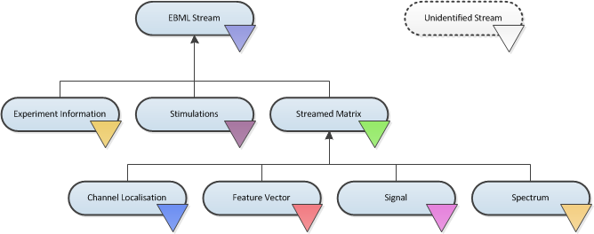
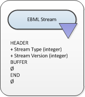
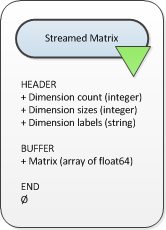
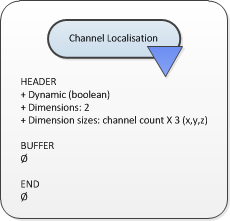
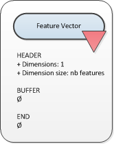
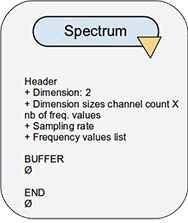
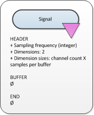
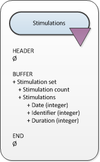
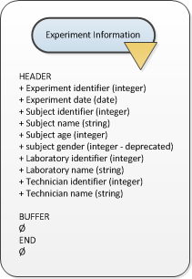
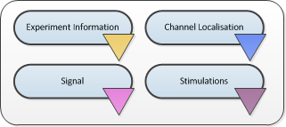

# OpenViBE Stream Structures {#stream-structures}

\page StreamStructures OpenViBE Stream Structures

## Introduction

All the streams are defined using EBML (Extensible Binary Meta-Language). They are all structured in 3 sections:

- **HEADER** :
  this part is the first ever sent and received on the stream, when the user presses "play" in a scenario. It usually contains the stream description used by the boxes and algorithms to initialize everything properly (e.g. size of an internal buffer)
- **BUFFERS** :
  the number of buffers that may then transit through the stream is unlimited. Buffers contain the payload, e.g. the current signal matrix.
- **END** :
  this last part is received once, when the user presses "stop" in a scenario. This mechanism is not concretely used in existing boxes, however everything is implemented to handle it.

## Hierarchy

The stream hierarchy is displayed on figure below. Every lower stream also
contains the information specific to the upper stream. The color of the
corresponding input and output in the Designer are also displayed.

  
The OpenViBE stream hierarchy

As you can see every stream is an **EBML stream**. Then the EBML container is
specialized in 3 streams : **experiment information**, **stimulations** or
**streamed matrix***.

The **Streamed Matrix** stream can be used as is, or as one of its 4 derived
streams : **channel localisation**, **channel units**, **feature vector**,
**signal** or **spectrum**.

```cpp
#define OVTK_TypeId_EBMLStream                                          OpenViBE::CIdentifier(0x434F6587, 0x2EFD2B7E)
#define   OVTK_TypeId_ExperimentInfo                                    OpenViBE::CIdentifier(0x403488E7, 0x565D70B6)
#define   OVTK_TypeId_Stimulations                                      OpenViBE::CIdentifier(0x6F752DD0, 0x082A321E)
#define   OVTK_TypeId_StreamedMatrix                                    OpenViBE::CIdentifier(0x544A003E, 0x6DCBA5F6)
#define     OVTK_TypeId_FeatureVector                                   OpenViBE::CIdentifier(0x17341935, 0x152FF448)
#define     OVTK_TypeId_Signal                                          OpenViBE::CIdentifier(0x5BA36127, 0x195FEAE1)
#define     OVTK_TypeId_Spectrum                                        OpenViBE::CIdentifier(0x1F261C0A, 0x593BF6BD)
#define     OVTK_TypeId_ChannelLocalisation                             OpenViBE::CIdentifier(0x1E4C0D6E, 0x5204EEB2)
#define     OVTK_TypeId_ChannelUnits                                    OpenViBE::CIdentifier(0x5E330216, 0x2C09724C)
```

The following sections will describe each stream type.

### Standard EBML stream

  
EBML stream description (November 6th 2006, version 1).

From any standard EBML stream header, you can retrieve the stream type identifier, and the stream version.

#### EBML description & identifiers

```cpp
// STREAM STRUCTURE
// ----------------
OVTK_NodeId_Header
OVTK_NodeId_Header_StreamType (integer:)
OVTK_NodeId_Header_StreamVersion (integer:)
OVTK_NodeId_Buffer
OVTK_NodeId_Buffer
...
OVTK_NodeId_End
```

```cpp
// NODE IDENTIFIERS
// ----------------
#define OVTK_NodeId_Header                                              EBML::CIdentifier(0x002B395F, 0x108ADFAE)
#define OVTK_NodeId_Header_StreamType                                   EBML::CIdentifier(0x00CDD0F7, 0x46B0278D)
#define OVTK_NodeId_Header_StreamVersion                                EBML::CIdentifier(0x006F5A08, 0x7796EBC5)
#define OVTK_NodeId_Buffer                                              EBML::CIdentifier(0x00CF2101, 0x02375310)
#define OVTK_NodeId_End                                                 EBML::CIdentifier(0x00D9DDC3, 0x0B12873A)
```

### Streamed matrix stream



Streamed matrix stream description (November 6th 2006, version 1).

The streamed matrix stream is an EBML Stream that also contains a matrix
descriptor in the header, and a **matrix of double precision floating values**
in its buffers. The matrix descriptor gives the **dimension count**, **size**
of each dimension, and **labels** of each dimension.

#### EBML description & identifiers

```cpp
// STREAM STRUCTURE
// ----------------
OVTK_NodeId_Header
OVTK_NodeId_Header_StreamType (integer:)
OVTK_NodeId_Header_StreamVersion (integer:)
OVTK_NodeId_Header_StreamedMatrix
OVTK_NodeId_Header_StreamedMatrix_DimensionCount (integer:)
OVTK_NodeId_Header_StreamedMatrix_Dimension
OVTK_NodeId_Header_StreamedMatrix_Dimension_Size (integer:)
OVTK_NodeId_Header_StreamedMatrix_Dimension_Label (string:)
OVTK_NodeId_Header_StreamedMatrix_Dimension_Label (string:)
...
OVTK_NodeId_Buffer
OVTK_NodeId_Buffer_StreamedMatrix
OVTK_NodeId_Buffer_StreamedMatrix_RawBuffer (array of double)
OVTK_NodeId_Buffer
OVTK_NodeId_Buffer_StreamedMatrix
OVTK_NodeId_Buffer_StreamedMatrix_RawBuffer (array of double)
...
OVTK_NodeId_End
```

```cpp
// NODE IDENTIFIERS
// ----------------
#define OVTK_NodeId_Header_StreamedMatrix                               EBML::CIdentifier(0x0072F560, 0x7ED2CBED)
#define OVTK_NodeId_Header_StreamedMatrix_DimensionCount                EBML::CIdentifier(0x003FEBD4, 0x2725D428)
#define OVTK_NodeId_Header_StreamedMatrix_Dimension                     EBML::CIdentifier(0x0000E3C0, 0x3A7D5141)
#define OVTK_NodeId_Header_StreamedMatrix_Dimension_Size                EBML::CIdentifier(0x001302F7, 0x36D8438A)
#define OVTK_NodeId_Header_StreamedMatrix_Dimension_Label               EBML::CIdentifier(0x00153E40, 0x190227E0)
#define OVTK_NodeId_Buffer_StreamedMatrix                               EBML::CIdentifier(0x00120663, 0x08FBC165)
#define OVTK_NodeId_Buffer_StreamedMatrix_RawBuffer                     EBML::CIdentifier(0x00B18C10, 0x427D098C)
```

### Channel localization stream



Channel localisation description (nov 04th 2008, version 1)

The channel localisation stream is a stream matrix stream with some
constraints:

- 2 dimensions : **channels** and **positions**
- First dimension has variable size (channel count)
- Second dimension has a size of 3 : the normalized cartesian coordinates in
  the following frame of reference : X right, Y front and Z up.

Its header also exposes a boolean value : **Dynamic**. If false the coordinates
are assumed to be static, thus sent once and for all (e.g. with an EEG system).
If Dynamic is set, the coordinates of the sensors may change over time, thus
several buffer can be received over time.

#### EBML description & identifiers

```cpp
// STREAM STRUCTURE
// ----------------
OVTK_NodeId_Header
OVTK_NodeId_Header_StreamType (integer:)
OVTK_NodeId_Header_StreamVersion (integer:2)
OVTK_NodeId_Header_ChannelLocalisation
OVTK_NodeId_Header_ChannelLocalisation_Dynamic (boolean)
OVTK_NodeId_Header_StreamedMatrix
OVTK_NodeId_Header_StreamedMatrix_DimensionCount (integer:2)
OVTK_NodeId_Header_StreamedMatrix_Dimension
OVTK_NodeId_Header_StreamedMatrix_Dimension_Size (integer:channel count)
OVTK_NodeId_Header_StreamedMatrix_Dimension_Label (string:channel 1 name)
OVTK_NodeId_Header_StreamedMatrix_Dimension_Label (string:channel 2 name)
...
OVTK_NodeId_Header_StreamedMatrix_Dimension
OVTK_NodeId_Header_StreamedMatrix_Dimension_Size (integer:3)
OVTK_NodeId_Header_StreamedMatrix_Dimension_Label (string:x)
OVTK_NodeId_Header_StreamedMatrix_Dimension_Label (string:y)
OVTK_NodeId_Header_StreamedMatrix_Dimension_Label (string:z)
OVTK_NodeId_Buffer
OVTK_NodeId_Buffer_StreamedMatrix
OVTK_NodeId_Buffer_StreamedMatrix_RawBuffer (array of double)
OVTK_NodeId_Buffer
OVTK_NodeId_Buffer_StreamedMatrix
OVTK_NodeId_Buffer_StreamedMatrix_RawBuffer (array of double)
...
OVTK_NodeId_End
```

```cpp
// NODE IDENTIFIERS
// ----------------
#define OVTK_NodeId_Header_ChannelLocalisation                          EBML::CIdentifier(0xF2CFE60B, 0xEFD63E3B)
#define OVTK_NodeId_Header_ChannelLocalisation_Dynamic                  EBML::CIdentifier(0x5338AF5C, 0x07C469C3)
```

### Channel units stream

Channel units description (mar 30th 2015, version 1).

The channel units stream is a streamed matrix stream intended to carry channel
measurement unit information from the drivers to Designer (e.g. ‘channel 1 is
in microvolts’). The stream has some constraints:

- 2 dimensions : **channels** and their **properties**
- First dimension has variable size (channel count)
- Second dimension has a size of 2 : the unit and the scaling factor.  Although
  the stream contents can be handled as a matrix, the unit codes and scaling
  factors supported and understood by OpenViBE are limited to a specific set.
  The list is in in `toolkit/include/ovtk_defines.h`.

Its header also exposes a boolean value : **Dynamic**. If false the units are assumed to be static, thus sent once and for all (e.g. with an EEG system). If Dynamic is set, the units may change over time, thus several buffer can be received over time. However, no component in 1.0.0 supports the dynamic units.

#### EBML description & identifiers

```cpp
// STREAM STRUCTURE
// ----------------
OVTK_NodeId_Header
OVTK_NodeId_Header_StreamType (integer:)
OVTK_NodeId_Header_StreamVersion (integer:2)
OVTK_NodeId_Header_ChannelUnits
OVTK_NodeId_Header_ChannelUnits_Dynamic (boolean)
OVTK_NodeId_Header_StreamedMatrix
OVTK_NodeId_Header_StreamedMatrix_DimensionCount (integer:2)
OVTK_NodeId_Header_StreamedMatrix_Dimension
OVTK_NodeId_Header_StreamedMatrix_Dimension_Size (integer:channel count)
OVTK_NodeId_Header_StreamedMatrix_Dimension_Label (string:channel 1 name)
OVTK_NodeId_Header_StreamedMatrix_Dimension_Label (string:channel 2 name)
...
OVTK_NodeId_Header_StreamedMatrix_Dimension
OVTK_NodeId_Header_StreamedMatrix_Dimension_Size (integer:2)
OVTK_NodeId_Header_StreamedMatrix_Dimension_Label (string:unit)
OVTK_NodeId_Header_StreamedMatrix_Dimension_Label (string:factor)
OVTK_NodeId_Buffer
OVTK_NodeId_Buffer_StreamedMatrix
OVTK_NodeId_Buffer_StreamedMatrix_RawBuffer (array of double)
OVTK_NodeId_Buffer
OVTK_NodeId_Buffer_StreamedMatrix
OVTK_NodeId_Buffer_StreamedMatrix_RawBuffer (array of double)
...
OVTK_NodeId_End
```

```cpp
// NODE IDENTIFIERS
// ----------------
#define OVTK_NodeId_Header                                              EBML::CIdentifier(0x002B395F, 0x108ADFAE)
#define OVTK_NodeId_Header_StreamType                                   EBML::CIdentifier(0x00CDD0F7, 0x46B0278D)
#define OVTK_NodeId_Header_StreamVersion                                EBML::CIdentifier(0x006F5A08, 0x7796EBC5)
#define OVTK_NodeId_Buffer                                              EBML::CIdentifier(0x00CF2101, 0x02375310)
#define OVTK_NodeId_End                                                 EBML::CIdentifier(0x00D9DDC3, 0x0B12873A)
```

### Feature vector stream



Feature vector stream description (may 24th 2007, version 1).

The feature vector stream is a stream matrix stream with some constraints:

- 1 dimension : the **features**
- Number of features may vary, but remains the same for one stream life time.

#### EBML description & identifiers

```cpp
// STREAM STRUCTURE
// ----------------
OVTK_NodeId_Header
OVTK_NodeId_Header_StreamType (integer:)
OVTK_NodeId_Header_StreamVersion (integer:)
OVTK_NodeId_Header_StreamedMatrix
OVTK_NodeId_Header_StreamedMatrix_DimensionCount (integer:1)
OVTK_NodeId_Header_StreamedMatrix_Dimension
OVTK_NodeId_Header_StreamedMatrix_Dimension_Size (integer:feature count)
OVTK_NodeId_Header_StreamedMatrix_Dimension_Label (string:feature 1 name)
OVTK_NodeId_Header_StreamedMatrix_Dimension_Label (string:feature 2 name)
...
OVTK_NodeId_Buffer
OVTK_NodeId_Buffer_StreamedMatrix
OVTK_NodeId_Buffer_StreamedMatrix_RawBuffer (array of double)
OVTK_NodeId_Buffer
OVTK_NodeId_Buffer_StreamedMatrix
OVTK_NodeId_Buffer_StreamedMatrix_RawBuffer (array of double)
...
OVTK_NodeId_End
```

### Spectrum stream



Spectrum stream description (jan. 2017, version 2).

The spectrum stream is a stream matrix stream with some constraints:

// 2 dimensions : **channels** and **number of frequency values**
// First dimension has variable size (channel count)
// Second dimension has variable size (number of frequency values)

Its header also expose the sampling rate of the signal and the list of frequency values used.

#### EBML description & identifiers

```cpp
// STREAM STRUCTURE
// ----------------
OVTK_NodeId_Header
OVTK_NodeId_Header_StreamType (integer:)
OVTK_NodeId_Header_StreamVersion (integer:)
OVTK_NodeId_Header_StreamedMatrix
OVTK_NodeId_Header_StreamedMatrix_DimensionCount (integer:2)
OVTK_NodeId_Header_StreamedMatrix_Dimension
OVTK_NodeId_Header_StreamedMatrix_Dimension_Size (integer:channel count)
OVTK_NodeId_Header_StreamedMatrix_Dimension_Label (string:channel 1 name)
OVTK_NodeId_Header_StreamedMatrix_Dimension_Label (string:channel 2 name)
...
OVTK_NodeId_Header_StreamedMatrix_Dimension
OVTK_NodeId_Header_StreamedMatrix_Dimension_Size (integer:number of frequency band)
OVTK_NodeId_Header_StreamedMatrix_Dimension_Label (string:frequency band 1 name)
OVTK_NodeId_Header_StreamedMatrix_Dimension_Label (string:frequency band 2 name)
...
OVTK_NodeId_Header_Spectrum
OVTK_NodeId_Header_Spectrum_Sampling
OVTK_NodeId_Header_Spectrum_FrequencyAbscissa (double)
OVTK_NodeId_Header_Spectrum_FrequencyAbscissa (double)
OVTK_NodeId_Header_Spectrum_FrequencyAbscissa (double)
...
OVTK_NodeId_Buffer
OVTK_NodeId_Buffer_StreamedMatrix
OVTK_NodeId_Buffer_StreamedMatrix_RawBuffer (array of double)
OVTK_NodeId_Buffer
OVTK_NodeId_Buffer_StreamedMatrix
OVTK_NodeId_Buffer_StreamedMatrix_RawBuffer (array of double)
...
OVTK_NodeId_End
```

```cpp
// NODE IDENTIFIERS
// ----------------
#define OVTK_NodeId_Header_Spectrum                                     EBML::CIdentifier(0x00CCFA4B, 0x14F37D4D)
#define OVTK_NodeId_Header_Spectrum_FrequencyBand_Deprecated            EBML::CIdentifier(0x0010983C, 0x21F8BDE5)
#define OVTK_NodeId_Header_Spectrum_FrequencyBand_Start_Deprecated      EBML::CIdentifier(0x00AA5654, 0x2403A2CB)
#define OVTK_NodeId_Header_Spectrum_FrequencyBand_Stop_Deprecated       EBML::CIdentifier(0x00A44C82, 0x05BE50D5)
#define OVTK_NodeId_Header_Spectrum_FrequencyAbscissa                   EBML::CIdentifier(0x00D7287D, 0x622A2BF5)
#define OVTK_NodeId_Header_Spectrum_Sampling                            EBML::CIdentifier(0x006876E9, 0x1DCB0CA1)
```

### Signal stream



Signal stream description (may 24th 2007, version 2).

The signal stream is a stream matrix stream with some constraints:

- 2 dimensions : **channels** and **samples**
- First dimension has variable size (channel count)
- Second dimension has a size corresponding to the **sample count per buffer**.

Its header also expose an integer value : the **Sampling Frequency**. Sampling
frequency and sample count per buffer depends on the data producer (file reader
or acquisition client).

#### EBML description & identifiers

```cpp
// STREAM STRUCTURE
// ----------------
OVTK_NodeId_Header
OVTK_NodeId_Header_StreamType (integer:)
OVTK_NodeId_Header_StreamVersion (integer:)
OVTK_NodeId_Header_Signal
OVTK_NodeId_Header_Signal_Sampling (integer)
OVTK_NodeId_Header_StreamedMatrix
OVTK_NodeId_Header_StreamedMatrix_DimensionCount (integer:2)
OVTK_NodeId_Header_StreamedMatrix_Dimension
OVTK_NodeId_Header_StreamedMatrix_Dimension_Size (integer:channel count)
OVTK_NodeId_Header_StreamedMatrix_Dimension_Label (string:channel 1 name)
OVTK_NodeId_Header_StreamedMatrix_Dimension_Label (string:channel 2 name)
...
OVTK_NodeId_Header_StreamedMatrix_Dimension
OVTK_NodeId_Header_StreamedMatrix_Dimension_Size (integer:number of samples per buffer)
OVTK_NodeId_Header_StreamedMatrix_Dimension_Label (string)
OVTK_NodeId_Header_StreamedMatrix_Dimension_Label (string)
...
OVTK_NodeId_Buffer
OVTK_NodeId_Buffer_StreamedMatrix
OVTK_NodeId_Buffer_StreamedMatrix_RawBuffer (array of double)
OVTK_NodeId_Buffer
OVTK_NodeId_Buffer_StreamedMatrix
OVTK_NodeId_Buffer_StreamedMatrix_RawBuffer (array of double)
...
OVTK_NodeId_End
```

```cpp
// NODE IDENTIFIERS
// ----------------
#define OVTK_NodeId_Header_Signal                                       EBML::CIdentifier(0x007855DE, 0x3748D375)
#define OVTK_NodeId_Header_Signal_Sampling                              EBML::CIdentifier(0x00141C43, 0x0C37006B)
```

### Stimulation stream



Stimulation stream description (may 24th 2007, version 3).

The stimulation stream is an EBML stream which buffers contains stimulation
sets. Each stimulation has 3 attributes:

- **Stimulation Date**: a 64bit unsigned integer in 32:32 precision (first 32 bits for the seconds, last 32 bits for the divisions)
- **Stimulation Identifier** as listed in the documentation page.
- **Stimulation Duration**: same encoding as stimulation date. In practice, the duration is never used by boxes, thus the value is most of the time 0.

#### EBML description & identifiers

```cpp
// STREAM STRUCTURE
// ----------------
OVTK_NodeId_Header
OVTK_NodeId_Header_StreamType (integer:)
OVTK_NodeId_Header_StreamVersion (integer:)
OVTK_NodeId_Buffer
OVTK_NodeId_Buffer_Stimulation
OVTK_NodeId_Buffer_Stimulation_NumberOfStimulations (integer)
OVTK_NodeId_Buffer_Stimulation_Stimulation
OVTK_NodeId_Buffer_Stimulation_Stimulation_ID (integer)
OVTK_NodeId_Buffer_Stimulation_Stimulation_Date (integer)
OVTK_NodeId_Buffer_Stimulation_Stimulation_Duration (integer)
OVTK_NodeId_Stimulation_Stimulation
...
OVTK_NodeId_Buffer
OVTK_NodeId_Buffer
...
OVTK_NodeId_End
```

```cpp
// NODE IDENTIFIERS
// ----------------
#define OVTK_NodeId_Buffer_Stimulation                                  EBML::CIdentifier(0x006DEABE, 0x7FC05A20)
#define OVTK_NodeId_Buffer_Stimulation_NumberOfStimulations             EBML::CIdentifier(0x00BB790B, 0x2B8574D8)
#define OVTK_NodeId_Buffer_Stimulation_Stimulation                      EBML::CIdentifier(0x0016EAC6, 0x29FBCAA1)
#define OVTK_NodeId_Buffer_Stimulation_Stimulation_ID                   EBML::CIdentifier(0x006FA5DB, 0x4BAC31E9)
#define OVTK_NodeId_Buffer_Stimulation_Stimulation_Date                 EBML::CIdentifier(0x00B866D8, 0x14DA5374)
#define OVTK_NodeId_Buffer_Stimulation_Stimulation_Duration             EBML::CIdentifier(0x14EE055F, 0x87FBCC9C)
```

### Experimentation information stream



Experimentation information stream description (november 6th 2006, version 1).

The experiment information stream is an EBML stream that provides in its header
some information about the experiment being conducted. These information are
entered for example in the acquisition server, when configuring the driver
before starting the acquisition. You can find:

- **Experiment description**: identifier and date.
- **Subject description**: identifier, name, age and gender.
- **Context**: laboratory identifier and name, technician identifier and name.

#### EBML description & identifiers

```cpp
// STREAM STRUCTURE
// ----------------
OVTK_NodeId_Header
OVTK_NodeId_Header_StreamType (integer:)
OVTK_NodeId_Header_StreamVersion (integer:)
OVTK_NodeId_Header_ExperimentInfo
OVTK_NodeId_Header_ExperimentInfo_Experiment
OVTK_NodeId_Header_ExperimentInfo_Experiment_ID (integer)
OVTK_NodeId_Header_ExperimentInfo_Experiment_Date (date)
OVTK_NodeId_Header_ExperimentInfo_Subject
OVTK_NodeId_Header_ExperimentInfo_Subject_ID (integer)
OVTK_NodeId_Header_ExperimentInfo_Subject_Name (string)
OVTK_NodeId_Header_ExperimentInfo_Subject_Age (integer)
OVTK_NodeId_Header_ExperimentInfo_Subject_Gender (integer)
OVTK_NodeId_Header_ExperimentInfo_Context
OVTK_NodeId_Header_ExperimentInfo_Context_LaboratoryID (integer)
OVTK_NodeId_Header_ExperimentInfo_Context_LaboratoryName (string)
OVTK_NodeId_Header_ExperimentInfo_Context_TechnicianID (integer)
OVTK_NodeId_Header_ExperimentInfo_Context_TechnicianName (string)
OVTK_NodeId_End
```

```cpp
// NODE IDENTIFIERS
// ----------------
#define OVTK_NodeId_Header_ExperimentInfo                               EBML::CIdentifier(0x00746BA0, 0x115AE04D)
#define OVTK_NodeId_Header_ExperimentInfo_Experiment                    EBML::CIdentifier(0x0011D6B7, 0x48F1AA39)
#define OVTK_NodeId_Header_ExperimentInfo_Experiment_ID                 EBML::CIdentifier(0x006ACD74, 0x1C960C26)
#define OVTK_NodeId_Header_ExperimentInfo_Experiment_Date               EBML::CIdentifier(0x002F8FB7, 0x6DA7552D)
#define OVTK_NodeId_Header_ExperimentInfo_Subject                       EBML::CIdentifier(0x003EC620, 0x333E0A94)
#define OVTK_NodeId_Header_ExperimentInfo_Subject_ID                    EBML::CIdentifier(0x00D62974, 0x473D4AA5)
#define OVTK_NodeId_Header_ExperimentInfo_Subject_Name                  EBML::CIdentifier(0x0041FD0A, 0x6BCD9A99)
#define OVTK_NodeId_Header_ExperimentInfo_Subject_Age                   EBML::CIdentifier(0x00DF7DD9, 0x33336C51)
// for retro compat
#define OVTK_NodeId_Header_ExperimentInfo_Subject_Sex                   EBML::CIdentifier(0x0069BB84, 0x3FC8E149)
#define OVTK_NodeId_Header_ExperimentInfo_Subject_Gender                EBML::CIdentifier(0x0069BB84, 0x3FC8E149)
#define OVTK_NodeId_Header_ExperimentInfo_Context                       EBML::CIdentifier(0x0018C291, 0x7985DFDD)
#define OVTK_NodeId_Header_ExperimentInfo_Context_LaboratoryID          EBML::CIdentifier(0x003F11B9, 0x26D76D9C)
#define OVTK_NodeId_Header_ExperimentInfo_Context_LaboratoryName        EBML::CIdentifier(0x00EB1F23, 0x51C23B83)
#define OVTK_NodeId_Header_ExperimentInfo_Context_TechnicianID          EBML::CIdentifier(0x00874A7F, 0x60DC34C2)
#define OVTK_NodeId_Header_ExperimentInfo_Context_TechnicianName        EBML::CIdentifier(0x00C8C393, 0x31CE5B3E)
```

### Acquisition stream



Acquisition stream description (nov 2014, version 3). This is a multiplexed
stream.

The acquisition stream encapsulates 5 streams : experiment information, channel
localisation, channel units, signal and stimulation.

This stream is produced by the Acquisition Server and is sent to every client
connected via tcp/ip network connection. The stream is received by the
Acquisition Client box, that separates each streams and makes them available on
5 corresponding outputs.

#### EBML description & identifiers

```cpp
// STREAM STRUCTURE
// ----------------
OVTK_NodeId_Header
  OVTK_NodeId_Acquisition_Header_ExperimentInfo
    ... some experiment information stream header
  OVTK_NodeId_Acquisition_Header_Signal
    ... some signal stream header
  OVTK_NodeId_Acquisition_Header_Stimulation
    ... some stimulation stream header
  OVTK_NodeId_Acquisition_Header_ChannelLocalisation
    ... some channel localisation stream header
  OVTK_NodeId_Acquisition_Header_ChannelUnits
    ... some channel units stream header
OVTK_NodeId_Buffer
  OVTK_NodeId_Acquisition_Buffer_ExperimentInfo
    ... some experiment information stream buffer
  OVTK_NodeId_Acquisition_Buffer_Signal
    ... some signal stream buffer
  OVTK_NodeId_Acquisition_Buffer_Stimulation
    ... some stimulation stream buffer
  OVTK_NodeId_Acquisition_Buffer_ChannelLocalisation
    ... some channel localisation stream buffer
  OVTK_NodeId_Acquisition_Buffer_ChannelUnits
    ... some channel units stream buffer
OVTK_NodeId_Buffer
OVTK_NodeId_Buffer
...
```
