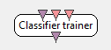

.. _Doc_BoxAlgorithm_ClassifierTrainer:

Classifier trainer
==================

.. container:: attribution

   :Author:
      Yann Renard, Guillaume Serriere
   :Company:
      INRIA/IRISA

Performs classifier training with cross-validation -based error estimation

The *Classifier Trainer* box is a generic box for training models to classify input data. 
It works in conjunction with the :ref:`Doc_BoxAlgorithm_ClassifierProcessor` box.
This box' role is to expose a generic interface to the rest of the BCI pipelines. The box 
will generate an internal structure according to the multiclass strategy and the learning
algorithm selected.

The behavior is simple, the box collects a number of feature vectors. Those feature vectors
are labelled depending on the input they arrive on. When a specific stimulation arrives, a training
process is triggered. This process can take some time so this box should be used offline. Depending on the
settings you enter, you will be able to perform a k-fold test to estimate the accuracy of the learned
classifier. When this training stimulation is received, the box generates a configuration file that will 
be usable online by the :ref:`Doc_BoxAlgorithm_ClassifierProcessor` box. 
Finally, the box outputs a particular stimulation (OVTK_StimulationId_TrainCompleted) 
on its output, that can be used to trigger further treatments in the scenario.

Inputs
------

.. csv-table::
   :header: "Input Name", "Stream Type"

   "Stimulations", "Stimulations"
   "Features for class 1", "Feature vector"
   "Features for class 2", "Feature vector"

This box can have a variable number of inputs. If you need more than two classes, feel free to add more
inputs and to use a proper strategy/classifier combination to handle more than two classes.

Stimulations
~~~~~~~~~~~~

The first input receives a stimulation stream. Only one stimulation of this stream is important, the one
that triggers the training process. When this stimulation is received, all the feature vectors are labelled
and sent to the classification algorithm. The training is triggered and executed. Then the classification
algorithm generates a configuration file that will be used online by the :ref:`Doc_BoxAlgorithm_ClassifierProcessor` box.

Features for class 1
~~~~~~~~~~~~~~~~~~~~

This input receives the feature vector for the first class.

Features for class 2
~~~~~~~~~~~~~~~~~~~~

This input receives the feature vector for the second class.

Outputs
-------

.. csv-table::
   :header: "Output Name", "Stream Type"

   "Train-completed Flag", "Stimulations"

Train-completed Flag
~~~~~~~~~~~~~~~~~~~~

The stimulation OVTK_StimulationId_TrainCompleted is raised on this output when the classifier trainer has finished its job.

.. _Doc_BoxAlgorithm_ClassifierTrainer_Settings:

Settings
--------

.. csv-table::
   :header: "Setting Name", "Type", "Default Value"

   "Train trigger", "Stimulation", "OVTK_StimulationId_Train"
   "Filename to save configuration to", "Filename", "${Path_UserData}/my-classifier.xml"
   "Multiclass strategy to apply", "Classification strategy", "Native"
   "Class 1 label", "Stimulation", "OVTK_StimulationId_Label_01"
   "Class 2 label", "Stimulation", "OVTK_StimulationId_Label_02"
   "Algorithm to use", "Classification algorithm", "Linear Discrimimant Analysis (LDA)"
   "Use shrinkage", "Boolean", "false"
   "Shrinkage coefficient (-1 == auto)", "Float", "-1.000000"
   "Shrinkage: Force diagonal cov (DDA)", "Boolean", "false"
   "Number of partitions for k-fold cross-validation test", "Integer", "10"
   "Balance classes", "Boolean", "false"

The number of settings of this box can vary depending on the classification algorithm you choose. Such algorithm
could have specific input OpenViBE::Kernel::IParameter objects (see OpenViBE::Kernel::IAlgorithmProxy for details). If
the type of those parameters is simple enough to be handled in the GUI, then additional settings will be added to this box.
**After switching a strategy or a classifier, you will have to close and re-open the settings configuration dialog to see the parameters of the new classifier.** Supported parameter types are : Integers, Floats, Enumerations, Booleans. The documentation for those
parameters can not be done in this page because it is impossible to know at this time what classifier thus what hyper
parameters you will have available. This will depend on the classification algorihtms that are be implemented in OpenViBE.

Train trigger
~~~~~~~~~~~~~

The stimulation that triggers the training process and save the learned classifier to disk.

Filename to save configuration to
~~~~~~~~~~~~~~~~~~~~~~~~~~~~~~~~~

This setting points to the configuration file where to save the result of the training for later online use. This
configuration file is used by the :ref:`Doc_BoxAlgorithm_ClassifierProcessor` box. Its syntax
depends on the selected algorithm.

Multiclass strategy to apply
~~~~~~~~~~~~~~~~~~~~~~~~~~~~

This setting is the strategy to use. You can choose any registered ``OVTK_TypeId_ClassificationStrategy``
strategy you want.

Class 1 label
~~~~~~~~~~~~~

This is the stimulation to send when the classifier algorithm detects a class-1 feature vector	

Class 2 label
~~~~~~~~~~~~~

This is the stimulation to send when the classifier algorithm detects a class-2 feature vector	

Algorithm to use
~~~~~~~~~~~~~~~~

This setting is the classifier to use. You can choose any registered ``OVTK_TypeId_ClassifierAlgorithm``
algorithm you want.

Number of partitions for k-fold cross-validation test
~~~~~~~~~~~~~~~~~~~~~~~~~~~~~~~~~~~~~~~~~~~~~~~~~~~~~

If you want to perform a k-fold test, you should enter something else than 0 or 1 here. A k-fold test generally gives
a better estimate of the classifiers accuracy than naive testing with the training data. The classifier may overfit
the training data, and get a good accuracy with the observed data, but not be able to generalize to unseen data. 
In cross-validation, the idea is to divide the set of  feature vectors in a number of partitions. The classification algorithm 
is trained on some of the partitions and its accuracy is tested on the others. However, the classifier produced by the box is 
the classifier trained with the whole data. The cross-validation is only an error estimation tool, it does not affect 
the resulting model. See the miscellaneous section for details on how the k-fold test is done in this box, and possible 
caveats about the cross-validation procedure.

Balance classes
~~~~~~~~~~~~~~~

If the number of class labels is unbalanced, the classifiers tend to be biased towards the majority labels.
This option can be used to resample the dataset to feature all classes equally. 

The algorithm first looks how many examples there are in the majority class. Lets say this is n. Then, if class k has m examples, 
it will random sample n-m examples with replacement from class k, appending them to the dataset. This will be done for each class. 
In the end, each class will have n examples and all except the majority class will have some duplicate training vectors. 
This can be seen as a technique to weight the importance of examples for such classifiers that do not support setting example weights 
or class weight prior, and can in general be attempted with arbitrary learning algorithms.

Enabling this option may make sense if the box is used for incremental learning, where all classes may not be equally represented 
in the training data obtained so far, even if the design itself is balanced. Note that enabling this will make the cross-validation 
results optimistic. In most conditions, the feature should be disabled.

.. _Doc_BoxAlgorithm_ClassifierTrainer_Examples:

Examples
--------

This box is used in BCI pipelines in order to classify cerebral activity states. For a detailed scenario using this
box and its associated :ref:`Doc_BoxAlgorithm_ClassifierProcessor`, please see the **motor imagary**
BCI scenario in the sample scenarios. An even more simple tutorial with artificial data 
is available in the **box-tutorials/** folder.

.. _Doc_BoxAlgorithm_ClassifierTrainer_Miscellaneous:

Miscellaneous
-------------

The box supports various multiclass strategies and classifiers as plugins.

\par Available strategy:
Strategy refers to how feature vectors are routed to one or more classifiers, which possibly can handle only 2 classes themselves.

\par Native
Use the classifier training algorithm without a pairwise strategy. All the data is passed to a single classifier trainer.

\par One Vs All
Use a pairwise strategy which consists of training each class against all the others, creating n classifiers for n classes.

\par One vs One
Use a airwise strategy which trains one classifier for each pair of classes. Then we use a decision startegy to extract the most likely class. There are three differents decision strategy:
\li Voting: method based on a simple majority voting process
\li HT: method described in: Hastie, Trevor ; Tibshirani, Robert. Classification by pairwise coupling. The Annals of Statistics 26 (1998), no. 2, 451--471
\li PKPD: method describe in: Price, S. Knerr, L. Personnaz, and G. Dreyfus. Pairwise neural network classifiers with probabilistic outputs. In G. Tesauro, D. Touretzky, and T. Leen (eds.)
Advances in Neural Information Processing Systems 7 (NIPS-94), pp. 1109-1116. MIT Press, 1995.
You cannot use every algorithm with every decision strategy, but the interface will restain the choice according to your selection.

\par Available classifiers:

\par Support Vector Machine (SVM)
A well-known classifier supporting non-linear classification via kernels. The implementation is based on LIBSVM 2.91, which is included in the OpenViBE source tree. The parameters exposed in the GUI correspond to LIBSVM parameters. For more information on LIBSVM, see <a href="http://www.csie.ntu.edu.tw/~cjlin/libsvm/">here</a>.
\par 
This algorithm provides only probabilities.

\par Linear Discriminant Analysis (LDA)
A simple and fast linear classifier. For description, see any major textbook on Machine Learning or Statistics (e.g. Duda, Hart & Stork, or Hastie, Tibshirani & Friedman). This algorithm can be used with a regularized covariance matrix
according to a method proposed by Ledoit & Wolf: "A Well-Conditioned Estimator for Large-Dimensional Covariance Matrices", 2004.
The Linear Discriminant Analysis has the following options.
\par
\li Use shrinkage: Use a classic or a regularized covariance matrix.
\li Shrinkage: A value s between [0,1] sets a linear weight between dataCov and priorCov. I.e. cov=(1-s)\*dataCov+s\*priorCov.
Value <0 is used to auto-estimate the shrinking coefficient (default). If var(x) is a vector of empirical variances of all data dimensions, priorCov is a 
diagonal matrix with a single value mean(var(x)) pasted on its diagonal. Used only if use shrinkage is checked.
\li Force diagonal cov (DDA): This sets the nondiagonal entries of the covariance matrices to zero. Used only if Use shrinkage is checked.
\par
Note that setting shrinkage to 0 should get you the regular LDA behavior. If you additionally force the covariance to be diagonal, you should get a model resembling the Naive Bayes classifier.
\par 
This algorithm provides both hyperplane distance and probabilities.

\par Multilayer Perceptron (MLP)
A classifier algorithm which relies on an artificial neural network (<a href="https://hal.inria.fr/inria-00099922/en">Laurent Bougrain. Practical introduction to artificial neural networks. IFAC symposium on automation in Mining, Mineral and Metal Processing - 
MMM'04, Sep 2004, Nancy, France, 6 p, 2004.</a>). In OpenViBE, the MLP is a 2-layer neural network. The hyperbolic tangent is the activation function of the
neurons inside the hidden layer. The network is trained using the backpropagation of the gradient. During the training, 80% of the training set is used to compute the gradient, 
and 20% is used to validate the new model. The different weights and biases are updated only once per iteration (just before the validation). A coefficient alpha (learning coefficient) is used to moderate the importance of 
the modification of weights and biases to avoid oscillations. The learning stops when the difference of the error per element (computed during validation) of two consecutive iterations is under the value epsilon given as a parameter.
\par
\li Number of neurons in hidden layer: number of neurons that will be used in the hidden layer.
\li Learning stop condition : the epsilon value used to stop the learning
\li Learning coefficient: a coefficient which influence the speed of learning. The smaller the coefficient is, the longer the learning will take, the more chance you will have to get a good solution.
\par
Note that feature vectors are normalized between -1 and 1 (using the min/max of the training set) to avoid saturation of the hyperbolic tangent.
\par
This algorithm provides both hyperplane distance (identity of output layer) and probabilites (softmax function on output layer).

\par Cross Validation 

In this section, we will detail how the k-fold test is implemented in this box. For the k-fold test to be performed, you
have to choose more than 1 partition in the related settings. Suppose you chose ``n`` partitions. Then when trigger stimulation
is received, the feature vector set is splitted in ``n`` consecutive segments. The classification algorithm is trained on
``n-1`` of those segments and tested on the last one. This is performed for each segment. 

For example, suppose you have 5 partitions of feature vectors (``FVs)``

.. code::

   +------+ +------+ +------+ +------+ +------+
   | FVs1 | | FVs2 | | FVs3 | | FVs4 | | FVs5 |
   +------+ +------+ +------+ +------+ +------+

For the first training, a feature vector set is built form the ``FVs2,`` ``FVs3,`` ``FVs4,`` ``FVs5.`` The classifier algorithm
is trained on this feature vector set. Then the classifier is tested on the ``FVs1`` :

.. code::

   +------+ +---------------------------------+
   | FVs1 | |  Training Feature Vector Set 1  |
   +------+ +---------------------------------+

Then, a feature vector set is built form the ``FVs1,`` ``FVs3,`` ``FVs4,`` ``FVs5.`` The classifier algorithm
is trained on this feature vector set. Then the classifier is tested on the ``FVs2`` :

.. code::

   +-------+ +------+ +------------------------+
   | Train | | FVs2 | | ing Feat. Vector Set 2 |
   +-------+ +------+ +------------------------+

The same process if performed on all the partitions :

.. code::

   +---------------+ +------+ +---------------+
   |Training Featur| | FVs3 | |e Vector Set 3 |
   +---------------+ +------+ +---------------+
   +------------------------+ +------+ +------+
   |Training Feature Vector | | FVs4 | |Set 4 |
   +------------------------+ +------+ +------+
   +---------------------------------+ +------+
   |  Training Feature Vector Set 5  | | FVs5 |
   +---------------------------------+ +------+

Important things to consider :

- The more partitions you have, the more feature vectors you have in your training sets... and the less examples 

you'll have to test on. This means that the result of the test will probably be less reliable. 

In conclusion, be careful when choosing this k-fold test setting. Typical value range from 4 partitions (train on 75% of the feature vectors and
test on 25% - 4 times) to 10 partitions (train on 90% of the feature vectors and test on 10% - 10 times).

Note that the cross-validation performed by the classifier trainer box in OpenViBE may be optimistic.
The cross-validation computation is working as it should, but it cannot take into account what happens outside
the classifier trainer box. In OpenViBE scenarios, there may be e.g. time overlap from epoching, feature
vectors drawn from the same epoch ending up in the same cross-validation partition, and (supervised) 
preprocessing such as CSP or xDAWN potentially overfitting the data before its given to the classifier trainer. 
Such situations are not compatible with the theoretical assumption that the feature vectors are 
independent and identically distributed (the typical iid assumption in machine learning) across
train and test. To do cross-validation controlling for such issues, we have provided
a more advanced cross-validation tutorial as part of the OpenViBE web documentation.

\par Confusion Matrices

At the end of the training, the box will print one or two confusion matrices, depending if cross-validation
was used: one matrix for the cross-validation, the other for the training data. Each matrix will contain true 
class as rows, and predicted class as columns. The diagonal describes the percentage of correct predictions per class. 
Although the matrix can be optimistic (see above section about the cross-validation), it may give useful 
diagnostic information. For example, if the accuracy is very skewed towards one class, this may indicate
a problem if the design is supposed to be balanced. The problem may originate e.g. from the original data 
source, the signal processing chains for the different classes, or the classifier learning algorithm. These need
then to be investigated. Also, if very low accuracies are observed in these matrices, it may give reason 
to suspect that prediction accuracies on fresh data might be likewise lacking -- or worse.

\par Incremental Learning

The box can also be used for simple incremental (online) learning. To achieve this, simply send the box the training
stimulation and it will train a classifier with all the data it has received so far. You can give it more
feature vectors later, and trigger the learning again by sending another stimulation. Likewise, the corresponding 
classifier processor box can be made to load new classifiers during playback. With classifiers like LDA, 
this practice is usually feasible when the data is reasonably sized (as in basic motor imagery).

