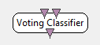

.. _Doc_BoxAlgorithm_VotingClassifier:

Voting Classifier
=================

.. container:: attribution

   :Author:
      Yann Renard
   :Company:
      INRIA

Each classifier used as input is assumed to have its own two-class output stream. Mainly designed for P300 scenario use.

The purpose of this simple classifier is to choose between multiple two class classifiers which
one mostly fits a condition. For example imagine ``n`` states. Each of those states can be either active
or inactive. Additionally, imagine you want only one active state at a time. Then you can have ``n``
two-class classifiers telling for each state if it is active or not, and a following voting classifier
that chooses which of those states is the *most active*.

Inputs
------

.. csv-table::
   :header: "Input Name", "Stream Type"

   "Classification result 1", "Stimulations"
   "Classification result 2", "Stimulations"

You can add as many inputs as you need depending on the number of preceeding states.

The inputs of this classifier can be changed to either streamed matrix of stimulations.

In the case you choose stimulations, each active stimulation gives a point
to the preceeding state. Both an inactive and a reject stimulation gives no point.
Any other stimulation is ignored.
After a number of repetitions, the state with the best score is chosen.

In the case you choose streamed matrix, the matrix must have only one
element. This element is used as a score coefficient (in place of the simple 1-0 of the previous
case).  After a number of repetitions, the state with the best score is chosen.

Classification result 1
~~~~~~~~~~~~~~~~~~~~~~~

Input stream for the first state.

Classification result 2
~~~~~~~~~~~~~~~~~~~~~~~

Input stream for the second state.

Outputs
-------

.. csv-table::
   :header: "Output Name", "Stream Type"

   "Classification choice", "Stimulations"

Classification choice
~~~~~~~~~~~~~~~~~~~~~

This output sends a new stimulation as soon as the classifier received the correct number of votes
from the preceeding states. The output stimulation is based on the 5th setting of the box. First
state being selected would send exactly this stimulation. Second state would send this
stimulation + 1 etc.

.. _Doc_BoxAlgorithm_VotingClassifier_Settings:

Settings
--------

.. csv-table::
   :header: "Setting Name", "Type", "Default Value"

   "Number of repetitions", "Integer", "12"
   "Target class label", "Stimulation", "OVTK_StimulationId_Target"
   "Non target class label", "Stimulation", "OVTK_StimulationId_NonTarget"
   "Reject class label", "Stimulation", "OVTK_StimulationId_Label_00"
   "Result class label base", "Stimulation", "OVTK_StimulationId_Label_01"
   "Choose one if ex-aequo", "Boolean", "false"

Number of repetitions
~~~~~~~~~~~~~~~~~~~~~

This setting tells the box how many votes it needs before choosing. If the box uses stimulations,
it must receive either the target or non target stimulation to consider a state has been voted.
Additionaly, the box waits each state to be voted the correct number of times to take a decision.

Target class label
~~~~~~~~~~~~~~~~~~

If the box uses stimulations, this settings tells what stimulation reflects that the state is active.

Non target class label
~~~~~~~~~~~~~~~~~~~~~~

If the box uses stimulations, this settings tells what stimulation reflects that the state is inactive.

Reject class label
~~~~~~~~~~~~~~~~~~

In case no choice can be made (for example, there are more than one state with the highest score), the
voting classifier can choose to reject the vote and send a specific stimulation for this. This is more
likely to happen when the box works on stimulation better than streamed matrix. You can force this box
to choose using the 6th setting.

Result class label base
~~~~~~~~~~~~~~~~~~~~~~~

This stimulation is used as a basis for the stimulations to send when a state is selected. First
state being selected would send exactly this stimulation. Second state would send this
stimulation + 1 etc.

Choose one if ex-aequo
~~~~~~~~~~~~~~~~~~~~~~

This setting can force the box to choose a state even if more than one state have the highest score.
In such case, there won't be any rejection. The way the box decides between the ex-aequo candidates
is undefined.

.. _Doc_BoxAlgorithm_VotingClassifier_Examples:

Examples
--------

This box is used in the *P300 speller* and the *P300 magic card* BCIs. Please see those
scenarios in the sample *openvibe-scenarios*.

