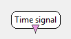

.. _Doc_BoxAlgorithm_TimeSignal:

Time signal
===========

.. container:: attribution

   :Author:
      Yann Renard
   :Company:
      INRIA/IRISA

This box generates a linear signal on a single channel.
The box can be used in order to test some processings on a specific
signal when no data is available. Each sample value of the generated
signal exactly equals to time in second.

Outputs
-------

.. csv-table::
   :header: "Output Name", "Stream Type"

   "Generated signal", "Signal"

Generated signal
~~~~~~~~~~~~~~~~

This output contains the generated signal.

.. _Doc_BoxAlgorithm_TimeSignal_Settings:

Settings
--------

.. csv-table::
   :header: "Setting Name", "Type", "Default Value"

   "Sampling frequency", "Integer", "512"
   "Generated epoch sample count", "Integer", "32"

Sampling frequency
~~~~~~~~~~~~~~~~~~

The first setting indicates the samling frequency of the produced signal in Hz.

Generated epoch sample count
~~~~~~~~~~~~~~~~~~~~~~~~~~~~

The last setting indicates how many sample will be sent for each output chunk.

.. _Doc_BoxAlgorithm_TimeSignal_Examples:

Examples
--------

In order to illustrate this case, just drag'n drop a :ref:`Doc_BoxAlgorithm_ContinuousOscilloscope`
box on the scenario and connect its input to a sinus oscillator box. You will be able to
see the generated signal.

For better use of this box, consider using an additional :ref:`Doc_BoxAlgorithm_SimpleDSP`
box. Put whatever function you like in this box configuration and visualize it with the
:ref:`Doc_BoxAlgorithm_ContinuousOscilloscope`.

