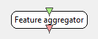

.. _Doc_BoxAlgorithm_FeatureAggregator:

Feature aggregator
==================

.. container:: attribution

   :Author:
      Bruno Renier
   :Company:
      INRIA/IRISA

Each chunk of input will be catenated into one feature vector.

This plugins aggregates the features it receives on its inputs
into a feature vector that can be used for classification.

Inputs
------

.. csv-table::
   :header: "Input Name", "Stream Type"

   "Input stream 1", "Streamed matrix"

Input stream 1
~~~~~~~~~~~~~~

A stream of matrices containing features.

Outputs
-------

.. csv-table::
   :header: "Output Name", "Stream Type"

   "Feature vector stream", "Feature vector"

Feature vector stream
~~~~~~~~~~~~~~~~~~~~~

A stream of feature vectors made by aggregating incoming features.

