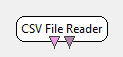
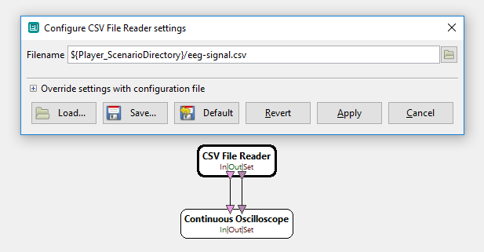

.. _Doc_BoxAlgorithm_CSVFileReader:

CSV File Reader
===============

.. container:: attribution

   :Author:
      Victor Herlin
   :Company:
      Mensia Technologies SA

This box reads a Comma Separated Values (CSV) text file. The file must be written using a specific
OpenViBE convention. The format is described in detail in :ref:`Doc_BoxAlgorithm_CSVFileWriter`

The file can contain two streams, one for matrix-type data and one for stimulations.

Outputs
-------

.. csv-table::
   :header: "Output Name", "Stream Type"

   "Output stream", "Signal"
   "Output stimulation", "Stimulations"

Output stream
~~~~~~~~~~~~~

This output can carry Signal, Streamed Matrix, Covariance, Spectrum and Feature Vector data.

Output stimulation
~~~~~~~~~~~~~~~~~~

This output will contain stimulations read from the file.

.. _Doc_BoxAlgorithm_CSVFileReader_Settings:

Settings
--------

.. csv-table::
   :header: "Setting Name", "Type", "Default Value"

   "Filename", "Filename", ""

Filename
~~~~~~~~

Path of the CSV file to read.

.. _Doc_BoxAlgorithm_CSVFileReader_Examples:

Examples
--------

Example of a scenario using the CSV Reader box to read a signal file and display it using an Oscilloscope.

   Reading a CSV file

