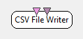
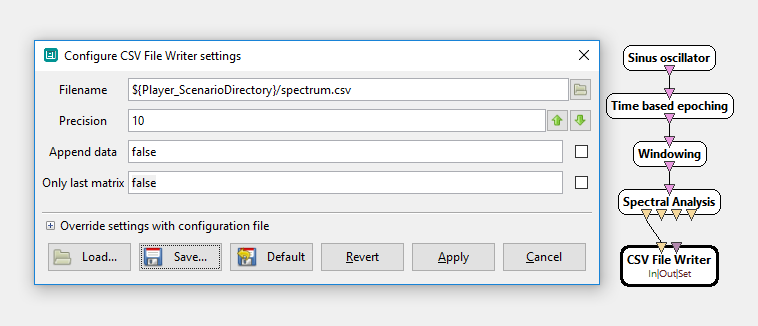

.. _Doc_BoxAlgorithm_CSVFileWriter:

CSV File Writer
===============

.. container:: attribution

   :Author:
      Victor Herlin
   :Company:
      Mensia Technologies SA

This box writes incoming time series along with a stimulation stream into a text file using the
Comma Separated Values format conforming to the RFC 4180 format.

The header of the CSV file contains some additional information that enables additional features
during subsequent reading. This format is described in the :ref:`Doc_BoxAlgorithm_CSVFileWriter_Miscellaneous`
section.

Inputs
------

.. csv-table::
   :header: "Input Name", "Stream Type"

   "Input stream", "Signal"
   "Stimulations stream", "Stimulations"

Input stream
~~~~~~~~~~~~

Time series input, this can be either a Signal, Streamed Matrix, Spectrum, Covariance Matrix or Feature Vector stream.

Stimulations stream
~~~~~~~~~~~~~~~~~~~

Stimulations to be written alongside the signal. 

.. _Doc_BoxAlgorithm_CSVFileWriter_Settings:

Settings
--------

.. csv-table::
   :header: "Setting Name", "Type", "Default Value"

   "Filename", "Filename", ""
   "Precision", "Integer", "10"
   "Append data", "Boolean", "false"
   "Only last matrix", "Boolean", "false"

Filename
~~~~~~~~

Path of the CSV file to be written.

- Default value : [ *record-[$core{date}-$core{time}].csv* ]

Precision
~~~~~~~~~

Precision, in number of decimal digits, of the resulting data. For longer data the precision can significantly impact the file size.

Append data
~~~~~~~~~~~

By default this box will overwrite data in the file if it exists. If this setting is set to true, the box will append data to the file instead. If the file is empty a header will be added as well. It is up to the user to ensure herself that the data written is of the same type and dimensions.

Only last matrix
~~~~~~~~~~~~~~~~

If this setting is activated, only the last received matrix will be written to the file. This can be used, for example, with cumulative average box.

.. _Doc_BoxAlgorithm_CSVFileWriter_Examples:

Examples
--------

Example of writing a spectrum into a CSV file:

   Writing a CSV file

.. _Doc_BoxAlgorithm_CSVFileWriter_Miscellaneous:

Miscellaneous
-------------

The CSV Format 

## Example file containing Signal data and Stimulations

Signal file sampled at 8Hz, with epochs of 0.5s length. Note that the timestamps do not have an end time which is implicit.

In this example each x represents an arbitrary floating point value. The header contains the following rows:

- Time:8Hz - contains the timestamp of each sample, this label also encodes the original sampling rate
- Epoch - contains the number of the epoch in which each sample is contained, this allows encoding even overlapping signal
- O1, O2, Pz, P3, P4 - channels containing EEG data
- Event Id - contains a colon separated list of StimulationIds
- Event Date - contains the same number of timestamps 
- Event Duration - is constructed in the same manner as Event Date

.. code::

   Time:8Hz,Epoch,O1,O2,Pz,P3,P4,Event Id,Event Date,Event Duration
   0.00000,0,x,x,x,x,x,,,
   0.12500,0,x,x,x,x,x,,,
   0.25000,0,x,x,x,x,x,32000:32010,0.25000:0.25000,0:0
   0.37500,0,x,x,x,x,x,,,
   0.50000,1,x,x,x,x,x,,,
   0.62500,1,x,x,x,x,x,,,
   0.75000,1,x,x,x,x,x,35000,0.75250,0
   0.87500,1,x,x,x,x,x,,,

## Example file containing a three dimensional matrix

This example file contains 2x2x2 matrices produced every 0.125 seconds and spanning one second.

The labels for this matrix are:

- for first dimension "LA", "LB"
- for second dimension "1", "2"
- for third dimension "X", "Y"

.. code::

   Time:2x2x2,End Time,LA:1:X,LA:1:Y,LA:2:X,LA:2:Y,LB:1:X,...,LB:2:Y,Event Id,Event Date,Event Duration
   0.00000,1.00000,x,x,x,x,x,...,x,,, 
   0.12500,1.12500,x,x,x,x,x,...,x,,, 
   0.25000,1.25000,x,x,x,x,x,...,x,,,
   0.37500,1.37500,x,x,x,x,x,...,x,,, 
   0.50000,1.50000,x,x,x,x,x,...,x,,, 
   0.62500,1.62500,x,x,x,x,x,...,x,,, 
   0.75000,1.75000,x,x,x,x,x,...,x,,,
   0.87500,1.62500,x,x,x,x,x,...,x,,, 
   1.00000,2.00000,x,x,x,x,x,...,x,,, 
   1.12500,2.12500,x,x,x,x,x,...,x,,, 

\note
A label can be an empty string. If second dimension had an empty label then the first column would have label "LA::X", if it were the third dimension the column would have label "LA:1:"

## Example file containing a spectrum

Spectrum file with 2 channels, 128Hz signal and spectra calculated on periods of 1 second every 0.125 seconds. The last element in the Time column (128) represents the original sampling rate.  

.. code::

   Time:2x64:128,End Time,O1:0,O1:1.015873,...,O1:64,O2:0,...,O2:64,Event Id,Event Date,Event Duration
   0.00000,1.00000,x,x,...,x,x,...,x,,,
   0.12500,1.12500,x,x,...,x,x,...,x,,,
   0.25000,1.25000,x,x,...,x,x,...,x,,,
   0.37500,1.37500,x,x,...,x,x,...,x,,,
   0.50000,1.50000,x,x,...,x,x,...,x,,,
   0.62500,1.62500,x,x,...,x,x,...,x,,,
   0.75000,1.75000,x,x,...,x,x,...,x,,,
   0.87500,1.87500,x,x,...,x,x,...,x,,,
   1.00000,2.00000,x,x,...,x,x,...,x,,,
   1.12500,2.12500,x,x,...,x,x,...,x,,,

