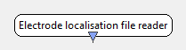

.. _Doc_BoxAlgorithm_ElectrodeLocalisationFileReader:

Electrode localisation file reader
==================================

.. container:: attribution

   :Author:
      Vincent Delannoy
   :Company:
      INRIA/IRISA

This box loads files holding the normalized coordinates of an electrode set.

Outputs
-------

.. csv-table::
   :header: "Output Name", "Stream Type"

   "Channel localisation", "Channel localisation"

Channel localisation
~~~~~~~~~~~~~~~~~~~~

The output channel localization information.

.. _Doc_BoxAlgorithm_ElectrodeLocalisationFileReader_Settings:

Settings
--------

.. csv-table::
   :header: "Setting Name", "Type", "Default Value"

   "Filename", "Filename", ""

Filename
~~~~~~~~

The normalized coordinates file.

.. _Doc_BoxAlgorithm_ElectrodeLocalisationFileReader_Examples:

Examples
--------

A default electrode set should be included in your NeuroRT distribution. Look for
it in the ``share/electrode_sets`` directory of the source tree of this plugin.
It comes as a :ref:`Doc_MatrixFileFormat` "text file" which is quite self explanatory,
open it in a text editor to edit it. Electrode names are specified in the header
section of the matrix, while actual coordinates are stored in the buffer section.

.. _Doc_BoxAlgorithm_ElectrodeLocalisationFileReader_Miscellaneous:

Miscellaneous
-------------

The coordinates loaded by this box are sent once only (static coordinates, e.g. EEG), as
opposed to regularly (dynamic coordinates, e.g. MEG).
The supported file format is the :ref:`Doc_MatrixFileFormat` "NeuroRT matrix" file format.
Electrode coordinates must be normalized cartesian coordinates in the following frame
of reference : X right, Y front and Z up.

