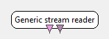

.. _Doc_BoxAlgorithm_GenericStreamReader:

Generic stream reader
=====================

.. container:: attribution

   :Author:
      Yann Renard
   :Company:
      INRIA

Generic Stream Writer box can be used to store data in the format read by this box

This box is able to read any file saved with the :ref:`Doc_BoxAlgorithm_GenericStreamWriter` box.
It is interesting to notice that such file can contain a variable number of streams. Therefore,
the user is able to add and modify any output he wants on the box. The box does not supposes
anything on the streams contained in the file during authoring in the designer. The streams of
the file are mapped to created output at runtime in an "intelligent way" depending on there types.

Outputs
-------

.. csv-table::
   :header: "Output Name", "Stream Type"

   "Output Signal", "Signal"
   "Output Stimulations", "Stimulations"

This box can have as many output you want depending on the content of the file.

Output Signal
~~~~~~~~~~~~~

This is the default output.

.. _Doc_BoxAlgorithm_GenericStreamReader_Settings:

Settings
--------

.. csv-table::
   :header: "Setting Name", "Type", "Default Value"

   "Filename", "Filename", ""

Filename
~~~~~~~~

This setting points to the file to read. This file may contain a variable number of multiplexed
streams. Those streams will be mapped to corresponding outputs at runtime. The mapping is done in
an "intelligent way" because it reorders the streams contained in the file to match the types of
the outputs. If a stream from the file does not find a matching output, a warning is launched.
If an output does not find a matching stream from the file, a warning is also launched.

