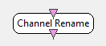

.. _Doc_BoxAlgorithm_ChannelRename:

Channel Rename
==============

.. container:: attribution

   :Author:
      Yann Renard
   :Company:
      Inria

This box renames the input channels with whatever name the author wants. The names
should be separated by a semi-colon ';'. 

Inputs
------

.. csv-table::
   :header: "Input Name", "Stream Type"

   "Input matrix", "Signal"

Input matrix
~~~~~~~~~~~~

The input matrix which channels should be renamed. The type of this input can be changed to
signal or spectrum depending on what kind of stream channel to rename.

Outputs
-------

.. csv-table::
   :header: "Output Name", "Stream Type"

   "Output matrix", "Signal"

Output matrix
~~~~~~~~~~~~~

The output matrix with renamed channels. The type of this output can be changed to
signal or spectrum depending on what kind of stream channel to rename.

.. _Doc_BoxAlgorithm_ChannelRename_Settings:

Settings
--------

.. csv-table::
   :header: "Setting Name", "Type", "Default Value"

   "New channel names", "String", "Channel 1;Channel 2"

New channel names
~~~~~~~~~~~~~~~~~

A semi-colon separated list of new channel names.

.. _Doc_BoxAlgorithm_ChannelRename_Examples:

Examples
--------

Suppose you compute the delta, alpha and beta band power at location Cz and merge the three
streams in a single stream. The resulting stream will handle three channels all named Cz. For
convenience, it could be useful to rename those channels Delta, Alpha and Beta respectively.
In order to achieve this, use a :ref:`Doc_BoxAlgorithm_ChannelRename` with the following setting
value : "Delta;Alpha;Beta" 

