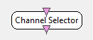

.. _Doc_BoxAlgorithm_ChannelSelector:

Channel Selector
================

.. container:: attribution

   :Author:
      Yann Renard
   :Company:
      Inria

Selection can be based on channel name (case-sensitive) or index starting from 0

This box allows to restrict outgoing signal data to a subset of incoming data based on a list of channels.
Channels may be identified by their index, their name (the case matters), or a mix of both. Additionally,
the channels can be rejected instead of being selected.
The name of the box displayed in the designer is the channel list (first setting). It allows the user to see directly if the box configuration is correct.
However, should the user chose to rename the box manually, further change in the configuration won't be reflected in the name, except if the name is set 
back to its default value.

Inputs
------

.. csv-table::
   :header: "Input Name", "Stream Type"

   "Input signal", "Signal"

Input signal
~~~~~~~~~~~~

The input matrix which channels should be selected or rejected. The type of this input can be changed to
Signal, Spectrum or Streamed matrix depending on what kind of stream channel to select.

Outputs
-------

.. csv-table::
   :header: "Output Name", "Stream Type"

   "Output signal", "Signal"

Output signal
~~~~~~~~~~~~~

The output matrix with selected or preserved channels. The type of this output can be changed to
signal or spectrum depending on what kind of stream channel to select.

.. _Doc_BoxAlgorithm_ChannelSelector_Settings:

Settings
--------

.. csv-table::
   :header: "Setting Name", "Type", "Default Value"

   "Channel List", "String", ":"
   "Action", "Selection method", "Select"
   "Channel Matching Method", "Match method", "Smart"

Channel List
~~~~~~~~~~~~

A semi colon separated list of channel identifiers. You can use the index of the channel or the name of the
channel. Also, ranges can be selected specifying first channel identifier, followed by a colon, followed by
the second channel identifier.

Action
~~~~~~

The action to perform on the identifier channel, be :

- ``select,``
- ``reject,``
- ``select`` ``EEG,`` selecting all EEG channels using their names. In this case, Channel List is no more considered.

Channel Matching Method
~~~~~~~~~~~~~~~~~~~~~~~

The kind of identification for channel list.

- ``Smart`` let the box try to detect if the channel identifier is an index or a name
- ``Name`` forces the channel identifiers to be considered as channel names. This can be useful if channel names are numbers.
- ``Index`` forces the channel identifiers to be considered as channel indices. This can be useful if channel names are numbers.

.. _Doc_BoxAlgorithm_ChannelSelector_Examples:

Examples
--------

Suppose you want to select the first 8 channels of an input stream, plus you want the Cz electrode and the last 3 channels. 
You would then use the following string : [1:8;Cz;-3:-1]. 

