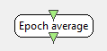

.. _Doc_BoxAlgorithm_EpochAverage:

Epoch average
=============

.. container:: attribution

   :Author:
      Yann Renard
   :Company:
      Inria/IRISA

This box can average matrices of different types including signal, spectrum or feature vectors

This box offers several methods of averaging for epoched streams.

Inputs
------

.. csv-table::
   :header: "Input Name", "Stream Type"

   "Input epochs", "Streamed matrix"

The input type of this box can be changed. Its type must be derived of
type :ref:`Doc_Streams_StreamedMatrix` in order to be parsed by the input
reader. If the author changes the input type, the output type will
be changed the same way.

Input epochs
~~~~~~~~~~~~

This input receives the input streamed matrix to average.

Outputs
-------

.. csv-table::
   :header: "Output Name", "Stream Type"

   "Averaged epochs", "Streamed matrix"

The output type of this box can be changed. Its type must be derived of
type :ref:`Doc_Streams_StreamedMatrix` in order for the writer to format
the  output chunks. If the author changes the output type, the input
type will be changed the same way.

Averaged epochs
~~~~~~~~~~~~~~~

This output sends the averaged streamed matrix. Averaging method is done
according to the box settings.

.. _Doc_BoxAlgorithm_EpochAverage_Settings:

Settings
--------

.. csv-table::
   :header: "Setting Name", "Type", "Default Value"

   "Averaging type", "Epoch Average method", "Moving epoch average"
   "Epoch count", "Integer", "4"

Averaging type
~~~~~~~~~~~~~~

This setting gives the method to use in order to average the input
matrices. It can be of two types :

- *Moving average* : in this case, the averaging is done at

every input reception on the last few buffers, starting as soon
as enough input has been received.

- *Moving average (Immediate)* : in this case, the averaging is done at

every input reception on the last few buffers, starting immediately. When
the number of received buffer is lower than the wished number of epochs, the
average is computed on this very few number of input buffers.

- *Epoch block average* : in this case, the averaging

is done on a number of epochs (see next setting). Once this exact
number of input is received, the average is computed and output.

- *Cumulative average* : in this case, the averaging

is done on an infinite number of epochs starting from the first
received buffer to the last received buffer. This can be **very**
memory consuming !

Epoch count
~~~~~~~~~~~

This setting tells the box how much buffer it should use in order to
compute the average.

.. _Doc_BoxAlgorithm_EpochAverage_Examples:

Examples
--------

Let's study two cases. First, suppose you have such box with 
*Epoch block average* set and *four* epochs.
The input stream is as follows :

.. code::

   +----+ +----+ +----+ +----+ +----+ +----+ +----+ +----+ +----+
   | I1 | | I2 | | I3 | | I4 | | I5 | | I6 | | I7 | | I8 | | I9 | ...
   +----+ +----+ +----+ +----+ +----+ +----+ +----+ +----+ +----+

The output stream will look like this :

.. code::

   +----+                      +----+
   | O1 |                      | O2 |        ...
   +----+                      +----+

where ``O1`` is the average of ``I1,`` ``I2,`` ``I3`` and ``I4`` and
where ``O2`` is the average of ``I5,`` ``I6,`` ``I7`` and ``I8.``

Now consider the case where you configured this box with
*Moving average* and *four* epochs. Given the
same input stream :

.. code::

   +----+ +----+ +----+ +----+ +----+ +----+ +----+ +----+ +----+
   | I1 | | I2 | | I3 | | I4 | | I5 | | I6 | | I7 | | I8 | | I9 | ...
   +----+ +----+ +----+ +----+ +----+ +----+ +----+ +----+ +----+

The output stream will look like this :

.. code::

   +----+ +----+ +----+ +----+ +----+ +----+
   | O1 | | O2 | | O3 | | O4 | | O5 | | O6 | ...
   +----+ +----+ +----+ +----+ +----+ +----+

where :

- ``O1`` is the average of ``I1,`` ``I2,`` ``I3`` and ``I4``
- ``O2`` is the average of ``I2,`` ``I3,`` ``I4`` and ``I5``
- ``O3`` is the average of ``I3,`` ``I4,`` ``I5`` and ``I6``
- ``O4`` is the average of ``I4,`` ``I5,`` ``I6`` and ``I7``
- etc...

Again consider the case where you configured this box with
*Moving average (Immediate)* and *four* epochs. Given the
same input stream :

.. code::

   +----+ +----+ +----+ +----+ +----+ +----+ +----+ +----+ +----+
   | I1 | | I2 | | I3 | | I4 | | I5 | | I6 | | I7 | | I8 | | I9 | ...
   +----+ +----+ +----+ +----+ +----+ +----+ +----+ +----+ +----+

The output stream will look like this :

.. code::

   +----+ +----+ +----+ +----+ +----+ +----+
   | O1 | | O2 | | O3 | | O4 | | O5 | | O6 | ...
   +----+ +----+ +----+ +----+ +----+ +----+

where :

- ``O1`` is exactly ``I1``
- ``O2`` is the average of ``I1`` and ``I2``
- ``O3`` is the average of ``I1,`` ``I2`` and ``I3``
- ``O4`` is the average of ``I1,`` ``I2,`` ``I3`` and ``I4``
- ``O5`` is the average of ``I2,`` ``I3,`` ``I4`` and ``I5``
- ``O6`` is the average of ``I3,`` ``I4,`` ``I5`` and ``I6``
- etc...

Finally consider the case where you configured this box with
*Cumulative average* and *four* epochs. Given the
same input stream :

.. code::

   +----+ +----+ +----+ +----+ +----+ +----+ +----+ +----+ +----+
   | I1 | | I2 | | I3 | | I4 | | I5 | | I6 | | I7 | | I8 | | I9 | ...
   +----+ +----+ +----+ +----+ +----+ +----+ +----+ +----+ +----+

The output stream will look like this :

.. code::

   +----+ +----+ +----+ +----+ +----+ +----+
   | O1 | | O2 | | O3 | | O4 | | O5 | | O6 | ...
   +----+ +----+ +----+ +----+ +----+ +----+

where :

- ``O1`` is exactly ``I1``
- ``O2`` is the average of ``I1`` and ``I2``
- ``O3`` is the average of ``I1,`` ``I2`` and ``I3``
- ``O4`` is the average of ``I1,`` ``I2,`` ``I3`` and ``I4``
- ``O5`` is the average of ``I1,`` ``I2,`` ``I3,`` ``I4,`` and ``I5``
- ``O6`` is the average of ``I1,`` ``I2,`` ``I3,`` ``I4,`` ``I5,`` and ``I6``
- etc...

