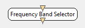

.. _Doc_BoxAlgorithm_FrequencyBandSelector:

Frequency Band Selector
=======================

.. container:: attribution

   :Author:
      Yann Renard
   :Company:
      Inria

This box selects a subset of a spectrum matrix, turning all un selected frequency
band to 0.

Inputs
------

.. csv-table::
   :header: "Input Name", "Stream Type"

   "Input spectrum", "Spectrum"

Input spectrum
~~~~~~~~~~~~~~

The input spectrum to select from.

Outputs
-------

.. csv-table::
   :header: "Output Name", "Stream Type"

   "Output spectrum", "Spectrum"

Output spectrum
~~~~~~~~~~~~~~~

The modified spectrum with unselected bands turned to 0

.. _Doc_BoxAlgorithm_FrequencyBandSelector_Settings:

Settings
--------

.. csv-table::
   :header: "Setting Name", "Type", "Default Value"

   "Frequencies to select", "String", "8:12;16:24"

Frequencies to select
~~~~~~~~~~~~~~~~~~~~~

The range of frequencies you want to select.

.. _Doc_BoxAlgorithm_FrequencyBandSelector_Examples:

Examples
--------

Suppose you have a full band spectrum and that you want to work on alpha band. You can use
a :ref:`Doc_BoxAlgorithm_FrequencyBandSelector` box to select this band for later processing
with the following setting : "8:12". Now suppose you want to work on two bands, for instance
Alpha and the 16-24Hz subset of Beta, you should use the following setting value : "8:12[SEMICOLON]16:24"
with [SEMICOLON] replaced by the actual semicolon charater.

