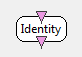

.. _Doc_BoxAlgorithm_Identity:

Identity
========

.. container:: attribution

   :Author:
      Yann Renard
   :Company:
      Inria/IRISA

This simply duplicates intput on its output

This box simply duplicates inputs to corresponding outputs in a similar way

Inputs
------

.. csv-table::
   :header: "Input Name", "Stream Type"

   "Input stream", "Signal"

This box can have any number of input of any type. Each input has a corresponding
output with the same type. Incoming chunks are simply duplicated to the corresponding output.

Input stream
~~~~~~~~~~~~

The default input for this box.

Outputs
-------

.. csv-table::
   :header: "Output Name", "Stream Type"

   "Output stream", "Signal"

This box can have any number of output of any type. Each output has a corresponding
input with the same type. Incoming chunks are simply duplicated to the corresponding output.

Output stream
~~~~~~~~~~~~~

The default output for this box.

.. _Doc_BoxAlgorithm_Identity_Examples:

Examples
--------

This box could be used in order to quickly switch between acquisition or file reading mode.
At the very top of the scenario, you would put an identity box with four connectors of type
:ref:`Doc_Streams_ExperimentInfo`, :ref:`Doc_Streams_Signal`, :ref:`Doc_Streams_Stimulation` and
:ref:`Doc_Streams_ChannelLocalization`.

