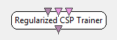

.. _Doc_BoxAlgorithm_RegularizedCSPTrainer:

Regularized CSP Trainer
=======================

.. container:: attribution

   :Author:
      Jussi T. Lindgren
   :Company:
      Inria

The box estimates a filter bank of spatial filters using Common Spatial Patterns (CSP) algorithm. The algorithm tries to find a linear transform of the data that 
makes the signal conditions (or classes) more distinct, when the data is projected to the matrix of the filters found by the algorithm (i.e. s=Wx, where we
assume x is the signal sample, W is the discovered filter bank, and s a lower-dimensional representation of the sample). The spatial filters are constructed 
for two conditions to maximize the variance of the signals of the first condition while at the same time minimizing it for the second condition. 
If signal variance contains discriminatory information, CSP filters can be useful in classification situations where designing spatial filter masks 
such as Laplacians manually is cumbersome or when it is believed that a filter optimized to the current data/user would produce better 
results than using an one-size-fits all filter.

In principle CSP can be useful in experiments where there is discriminative information in the variance (or power) of the signal conditions,
for example motor imagery or SSVEP.

The box implements some of the methods described e.g. by Lotte & Guan [1]. Especially, it 
allows using the methods called "CSP with Diagonal Loading" and "CSP with Tikhonov Regularization" in the paper. In the approach of
the paper, the filters for condition 1 are found by eigenvector decomposition of inv(Sigma1+rho\*I)\*Sigma2, where Sigma1 and Sigma2 are 
empirical covariance matrices for the two conditions, rho the amount of Tikhonov regularization and I an identity matrix. For condition 2, 
the formula is the same with the sigmas swapped. The matrices Sigma1 and Sigma2 may be optionally shrunk towards diagonal matrices. 

In situations with more than two conditions, the box implements a one-vs-all approach, where each class gives a Sigma1 in turn, with the 
covariances of the other classes combined with a class frequency weighted average to obtain Sigma2. Hence, for k classes, k pairings 
are estimated, and out of each pair, a requested amount of filters is selected separately. This results in k times the amount of filters
requested in total.

To avoid caching the whole dataset in the box, the algorithm tries to estimate the required covariances incrementally. The box supports
a few different incremental ways to compute the covariances. The 'block average' approach takes an average of all the covariances of the incoming 
signal chunks, an approach described in [2], whereas the incremental (per sample) method aims to implement Youngs & Cramer 
algorithm as described in [3]. Which one gives better results may depend on the situation -- however, 
taking an average of covariance matrices is not your usual textbook method for computing covariance over the whole data. 

Finally, the box also presents an option to try to compensate for the effect of changes in the average signal power over time. This is 
can be done by enabling 'Trace Normalization' setting. When trace normalization is enabled, each data chunks contribution to 
the covariance gets divided by its trace. See miscellaneous notes for details.

Inputs
------

.. csv-table::
   :header: "Input Name", "Stream Type"

   "Stimulations", "Stimulations"
   "Signal condition 1", "Signal"
   "Signal condition 2", "Signal"

Stimulations
~~~~~~~~~~~~

This stimulus input is needed to indicate the end of a recording session (or end of file). It triggers the training/computation of the CSP filters.

Signal condition 1
~~~~~~~~~~~~~~~~~~

This input expects epoched data for the first condition (e.g. epochs for left hand motor imagery).

Signal condition 2
~~~~~~~~~~~~~~~~~~

This input expects epoched data for the second condition (e.g. epochs for right hand motor imagery).

Outputs
-------

.. csv-table::
   :header: "Output Name", "Stream Type"

   "Train-completed Flag", "Stimulations"

Train-completed Flag
~~~~~~~~~~~~~~~~~~~~

The CSP Trainer outputs the stimulation **OVTK_StimulationId_TrainCompleted** when the training process was successful. No output is produced if the process failed.

.. _Doc_BoxAlgorithm_RegularizedCSPTrainer_Settings:

Settings
--------

.. csv-table::
   :header: "Setting Name", "Type", "Default Value"

   "Train Trigger", "Stimulation", "OVTK_GDF_End_Of_Session"
   "Spatial filter configuration", "Filename", ""
   "Filters per condition", "Integer", "2"
   "Save filters as box config", "Boolean", "false"
   "Covariance update", "Update method", "Chunk average"
   "Trace normalization", "Boolean", "false"
   "Shrinkage coefficient", "Float", "0.0"
   "Tikhonov coefficient", "Float", "0.0"

Train Trigger
~~~~~~~~~~~~~

The stimulus identifier denoting the end of a recording session or end of file, e.g. OVTK_GDF_End_Of_Session or OVTK_StimulationId_ExperimentStop.

Spatial filter configuration
~~~~~~~~~~~~~~~~~~~~~~~~~~~~

The path and filename of the configuration file in which the computed spatial filters are saved. 

Filters per condition
~~~~~~~~~~~~~~~~~~~~~

How many spatial filters should be selected per class.

Save filters as box config
~~~~~~~~~~~~~~~~~~~~~~~~~~

If true, the file written will be a box configuration override especially for the spatial filter box. Otherwise, it will be an ASCII matrix.

Covariance update
~~~~~~~~~~~~~~~~~

Method to update the covariances

Trace normalization
~~~~~~~~~~~~~~~~~~~

Is trace normalization done when appending the per-chunk covariances? 

Shrinkage coefficient
~~~~~~~~~~~~~~~~~~~~~

The amount of shrinkage, between 0 and 1. It interpolates between the covariance matrices and the diagonal matrix.

Tikhonov coefficient
~~~~~~~~~~~~~~~~~~~~

The amount of Tikhonov regularization, bigger signifies more. This equals parameter rho in the description above. If 0, the method behaves approximately as a regular CSP. 

.. _Doc_BoxAlgorithm_RegularizedCSPTrainer_Miscellaneous:

Miscellaneous
-------------

The suitable amount of regularization may depend on the variance of the data. You may need to try different values to find the one that suits your situation best.
Before the CSP training, it may be useful to temporally filter the input data to remove bands which are believed to have no relevant discriminative information.

Note that the usage of the CSP filters before classification training can make the cross-validation results optimistic, unless strictly non-overlapping parts of the data were used to train the CSP and the classifier (disjoint sets for each). 

The trace normalization can be found in the literature [2]. The idea is to normalize the scale of each chunk in order to 
compensate for a possible signal power drift over time during the EEG recording, making each chunks' covariance contribute 
similarly to the aggregate regardless of the current chunks average power. 

To get the "CSP with Diagonal Loading" of Lotte & Guan paper [1], set shrinkage to a positive value and Tikhonov to 0. To get the 
"CSP with Tikhonov regularization", do the opposite. You can also try a mixture of the two. Note that the Guan & Lotte paper does not appear to use trace normalization.

To get the CSP resembling the one in the Muller-Gerkin paper, set Trace Normalization to True and the Covariance method to Chunk Average, with no regularization. Then, feed the algorithm each trial as a separate chunk (with Stimulation based epoching box). This is also the classic OV way of computing the CSP.

Once the spatial filters are computed and saved, you can load and apply the filters with the :ref:`Doc_BoxAlgorithm_SpatialFilter` "Spatial Filter" box.

References

1) Lotte & Guan: "Regularizing common spatial patterns to Improve BCI Designs: Unified Theory and New Algorithms", 2011.

2) Muller-Gerkin & al., "Designing optimal spatial filters for single-trial EEG classification in a movement task", 1999.

3) Chan, Golub & Leveq, "Updating formulae and a pairwise algorithm  for computing sample variances", 1979.

