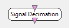

.. _Doc_BoxAlgorithm_SignalDecimation:

Signal Decimation
=================

.. container:: attribution

   :Author:
      Yann Renard
   :Company:
      Inria

No pre filtering applied - Number of samples per block have to be a multiple of the decimation factor

This box reduces the sampling frequency of an input signal *the easy way*.
It is different of the existing :ref:`Doc_BoxAlgorithm_SignalResampling` box in the sense
that there is no pre-filtering and that you can not choose an arbitrary sampling
frequency. Thus you will have to pre-filter the input signal with the
:ref:`Doc_BoxAlgorithm_TemporalFilter` box for example. The new sampling frequency
will be an exact divider of the source signal sampling frequency. For instance, if your
input sampling frequency is 1000Hz, you are allowed to divide that frequency by 2 or 4
but you can't divide it by 3. See section :ref:`Doc_BoxAlgorithm_SignalDecimation_Examples`
for a detailed example of what can be done.

Inputs
------

.. csv-table::
   :header: "Input Name", "Stream Type"

   "Input signal", "Signal"

Input signal
~~~~~~~~~~~~

The input signal.

Outputs
-------

.. csv-table::
   :header: "Output Name", "Stream Type"

   "Output signal", "Signal"

Output signal
~~~~~~~~~~~~~

The decimated signal.

.. _Doc_BoxAlgorithm_SignalDecimation_Settings:

Settings
--------

.. csv-table::
   :header: "Setting Name", "Type", "Default Value"

   "Decimation factor", "Integer", "8"

Decimation factor
~~~~~~~~~~~~~~~~~

The sampling rate divider. At each chunk reception, 1 sample among n of the input signal will be
sent to the output signal.

.. _Doc_BoxAlgorithm_SignalDecimation_Examples:

Examples
--------

Suppose you have a signal with a sampling rate of 1000Hz streamed with 32 samples per buffer
that you want to downsample to 100Hz. Downsampling this signal to 100Hz will require that you
low-pass filter the signal to at most 50Hz to avoid bad results. Additionally,
Changing the epoch sizes using a the
:ref:`Doc_BoxAlgorithm_TimeBasedEpoching` box and configuring it e.g. for epochs of 0.1s every
0.1s will cause this box to output 10 samples sized buffers.

