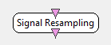

.. _Doc_BoxAlgorithm_SignalResampling:

Signal Resampling
=================

.. container:: attribution

   :Author:
      Quentin Barthelemy
   :Company:
      Mensia Technologies

The input signal is resampled, down-sampled or up-sampled, at a chosen sampling frequency and then re-epoched.

This plugin can apply a downsampling or an upsampling, to/from any sampling frequency, including non-integer sampling rate conversion. 
The signal is low-pass filtered with a FIR filter to avoid spectral aliasing, using a sinc function-based fractional delay filter bank.

If the sampling rate is badly conditioned, this plugin can induce latency.

Inputs
------

.. csv-table::
   :header: "Input Name", "Stream Type"

   "Input signal", "Signal"

Input signal
~~~~~~~~~~~~

An input multichannel signal :math:`X \in \mathbb{R}^{C \times N_1}`, composed of :math:`C` channels and :math:`N_1` temporal samples, at the sampling frequency :math:`F_1`.

Outputs
-------

.. csv-table::
   :header: "Output Name", "Stream Type"

   "Output signal", "Signal"

Output signal
~~~~~~~~~~~~~

An output multichannel signal :math:`Y \in \mathbb{R}^{C \times N_2}`, composed of :math:`C` channels and :math:`N_2` temporal samples, at the sampling frequency :math:`F_2`.

.. _Doc_BoxAlgorithm_SignalResampling_Settings:

Settings
--------

.. csv-table::
   :header: "Setting Name", "Type", "Default Value"

   "New Sampling Frequency", "Integer", "128"
   "Sample Count Per Buffer", "Integer", "8"
   "Low Pass Filter Signal Before Downsampling", "Boolean", "true"

New Sampling Frequency
~~~~~~~~~~~~~~~~~~~~~~

New sampling frequency :math:`F_2 > 0`. No processing is applied if :math:`F_2 = F_1`.

Sample Count Per Buffer
~~~~~~~~~~~~~~~~~~~~~~~

Number of temporal samples :math:`N_2 > 0` per resampled buffer.

Low Pass Filter Signal Before Downsampling
~~~~~~~~~~~~~~~~~~~~~~~~~~~~~~~~~~~~~~~~~~

Low-pass filtering activation, to avoid spectral aliasing.

