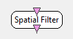

.. _Doc_BoxAlgorithm_SpatialFilter:

Spatial Filter
==============

.. container:: attribution

   :Author:
      Yann Renard, Jussi T. Lindgren
   :Company:
      Inria

The applied coefficient matrix must be specified as a box parameter. The filter processes each sample independently of the past samples.

The spatial filter generates a number of output channels from another number of input
channels, each output channel being a linear combination of the input channels.

For example, lets say :math:`IC_j` is the :math:`j` th input channel, :math:`OC_k` is the
:math:`k` th output channel, and :math:`S_{jk}` is the coefficient for the :math:`j` th input
channel and :math:`k` th output channel in the Spatial filter matrix.
 
Then the output channels are computed this way :
:math:`OC_k = \sum_j S_{jk} * IC_j`.

Inputs
------

.. csv-table::
   :header: "Input Name", "Stream Type"

   "Input Signal", "Signal"

Input Signal
~~~~~~~~~~~~

This input contains the input channels to mix.

Outputs
-------

.. csv-table::
   :header: "Output Name", "Stream Type"

   "Output Signal", "Signal"

Output Signal
~~~~~~~~~~~~~

This output contains the generated channels, mixed from the input channels.

.. _Doc_BoxAlgorithm_SpatialFilter_Settings:

Settings
--------

.. csv-table::
   :header: "Setting Name", "Type", "Default Value"

   "Spatial Filter Coefficients", "String", "1;0;0;0;0;1;0;0;0;0;1;0;0;0;0;1"
   "Number of Output Channels", "Integer", "4"
   "Number of Input Channels", "Integer", "4"
   "Filter matrix file", "Filename", ""

Spatial Filter Coefficients
~~~~~~~~~~~~~~~~~~~~~~~~~~~

This setting contains a flat view of the spatial filter matrix. The coefficient orders is as follows :
all the coefficients for the first output followed by all the coefficients for the second output and so on..

Number of Output Channels
~~~~~~~~~~~~~~~~~~~~~~~~~

Number of output channels to generate

Number of Input Channels
~~~~~~~~~~~~~~~~~~~~~~~~

Number of input channels to compute from

Filter matrix file
~~~~~~~~~~~~~~~~~~

Filter matrix. You can alternatively provide the filter coefficients as an ASCII file. 

.. _Doc_BoxAlgorithm_SpatialFilter_Examples:

Examples
--------

Let's consider the following example :

- Input channels list: C3;C4;FC3;FC4;C5;C1;C2;C6;CP3;CP4 (10 channels) 

- Spatial filter coefficients: 4 0 -1 0 -1 -1 0 0 -1 0 0 4 0 -1 0 0 -1 -1 0 -1 (20 values)
- Number of output channels: 2
- Number of input channels: 10

The output channels becomes :

.. code::

   OC1 = 4 * C3 + 0 * C4 + (-1) * FC3 + 0 * FC4 + (-1) * C5 + (-1) * C1 + 0 * C2 + 0 * C6 + (-1) * CP3 + 0 * CP4
   = 4 * C3 - FC3 - C5 - C1 - CP3
   
   OC2 = 0 * C3 + 4 * C4 + 0 * FC3 + (-1) * FC4 + 0 * C5 + 0 * C1 + (-1) * C2 + (-1) * C6 + 0 * CP3 + (-1) * CP4
   = 4 * C4 - FC4 - C2 - C6 - CP4

This is basically a Surface Laplacian around C4 and C5.

.. _Doc_BoxAlgorithm_SpatialFilter_Miscellaneous:

Miscellaneous
-------------

For large filters, it is somewhat faster to provide the matrix in an ASCII file than having the coefficients in scenario.xml directly. 
If a file is used, the filter size is read from the file and the other parameters of the box are ignored.

To provide the filter matrix as a file, the format is the same as is used for storing electrode localizations. E.g. for 3x3 identity matrix, the file would be

.. code::

   [ [ "row1" "row2" "row3" ] [ "col1" "col2" "col3" ] ]
   [ [ 1 0 0 ] ]
   [ [ 0 1 0 ] ]
   [ [ 0 0 1 ] ]

