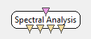

.. _Doc_BoxAlgorithm_SpectralAnalysis:

Spectral Analysis
=================

.. container:: attribution

   :Author:
      Laurent Bonnet / Quentin Barthelemy
   :Company:
      Mensia Technologies

Performs a Spectral Analysis using FFT.

The Spectral Analysis box performs spectrum computations on incoming signals and possible outputs include the spectrum amplitude (the power of the signal in a number of frequency bands), as well as its phase, real part and imaginary part. 
Output computations may be enabled/disabled from the settings dialogue box. The analysis is performed using a **Fast Fourier Transform**.
Do not forget to apply a :ref:`Doc_BoxAlgorithm_Windowing` step before spectral analysis.

Considering an input signal :math:`X \in \mathbb{R}^{C \times N}`, composed of :math:`C` channels and :math:`N` temporal samples, this plugin computes the spectrum of this signal :math:`\Phi \in \mathbb{C}^{C \times F}`, composed of :math:`C` channels and :math:`F` frequencies.
Input signal being real, the spectrum exhibits conjugate symmetry: consequently, only half of the spectrum is returned with :math:`F = \left\lfloor N/2 \right\rfloor + 1`.
For the :math:`c^{ \text{th} }` channel and the :math:`f^{ \text{th} }` frequency, the spectrum is defined as:
:math:`\Phi(c,f) = \Phi_r(c,f) + \mathsf{i} \times \Phi_i(c,f) = \left| \Phi(c,f) \right| \times e^{\mathsf{i} \arg(\Phi(c,f))}`
with :math:`\mathsf{i}` being the imaginary unit.

Using these notations, for the :math:`c^{ \text{th} }` channel, the Parseval's Theorem gives:
:math:`\sum_{n=0}^{N-1} \left| X(c,n) \right|^2 = \frac{1}{N} \sum_{f=0}^{F-1} \left| \Phi(c,f) \right|^2`
with :math:`\left| \Phi(c,f) \right|^2 = \Phi_r(c,f)^2 + \Phi_i(c,f)^2`.

Inputs
------

.. csv-table::
   :header: "Input Name", "Stream Type"

   "Input signal", "Signal"

Input signal
~~~~~~~~~~~~

An input multichannel signal :math:`X \in \mathbb{R}^{C \times N}`, composed of :math:`C` channels and :math:`N` temporal samples.

Outputs
-------

.. csv-table::
   :header: "Output Name", "Stream Type"

   "Amplitude", "Spectrum"
   "Phase", "Spectrum"
   "Real Part", "Spectrum"
   "Imaginary Part", "Spectrum"

Amplitude
~~~~~~~~~

An output spectral amplitude (absolute value) :math:`\left| \Phi \right| \in \mathbb{R}^{C \times F}`.

Phase
~~~~~

An output spectral phase :math:`\arg(\Phi) \in \mathbb{R}^{C \times F}`, in radians.

Real Part
~~~~~~~~~

An output real part of the spectrum :math:`\Phi_r \in \mathbb{R}^{C \times F}`.

Imaginary Part
~~~~~~~~~~~~~~

An output imaginary part of the spectrum :math:`\Phi_i \in \mathbb{R}^{C \times F}`.

.. _Doc_BoxAlgorithm_SpectralAnalysis_Settings:

Settings
--------

.. csv-table::
   :header: "Setting Name", "Type", "Default Value"

   "Amplitude", "Boolean", "true"
   "Phase", "Boolean", "false"
   "Real Part", "Boolean", "false"
   "Imaginary Part", "Boolean", "false"

Amplitude
~~~~~~~~~

Activate or not the Amplitude output. 

Phase
~~~~~

Activate or not the Phase output. 

Real Part
~~~~~~~~~

Activate or not the Real Part output. 

Imaginary Part
~~~~~~~~~~~~~~

Activate or not the Imaginary Part output. 

.. _Doc_BoxAlgorithm_SpectralAnalysis_Examples:

Examples
--------

Practical example : visualising the power spectrum of a signal.

Let's use a Signal Oscillator box to generator sinusoidal signals on one channel. Next we add a Spectral Analysis box and connect boxes together. We make sure the 'Amplitude' of the signal is computed by checking the appropriate setting in the settings dialog box (see image below). Finally, we connect the 'Amplitude' output connector of the Spectral Analysis box to the input connector of a Power Spectrum Display box. The player may now be launched to visualize the power spectrum of the signal.

.. figure:: images/spectralanalysis_online.png
   :alt: Visualising the power spectrum of sinusoidal signals.
   :align: center

   Visualising the power spectrum of sinusoidal signals.

.. _Doc_BoxAlgorithm_SpectralAnalysis_Miscellaneous:

Miscellaneous
-------------

To verify the Parseval's Theorem, in version 1.1, spectra have been multiplied by :math:`\sqrt{2}` with respect the previous version 1.0.
DC bin and Nyquist bin (when :math:`N` is even) are not concerned by this correction.

