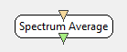

.. _Doc_BoxAlgorithm_SpectrumAverage:

Spectrum Average
================

.. container:: attribution

   :Author:
      Yann Renard
   :Company:
      Inria

This box can be used in conjunction with the :ref:`Doc_BoxAlgorithm_SpectralAnalysis` and
the :ref:`Doc_BoxAlgorithm_FrequencyBandSelector` boxes in order to compute a power in specific
frequency bands of a spectrum. The output is a column matrix giving a single value for each
channel : the actual average power of the spectrum. You can may want to use these values
with the :ref:`Doc_BoxAlgorithm_SimpleDSP` to get ratios.

Inputs
------

.. csv-table::
   :header: "Input Name", "Stream Type"

   "Spectrum", "Spectrum"

Spectrum
~~~~~~~~

This input should connect to a spectrum stream, either filtered with the
:ref:`Doc_BoxAlgorithm_FrequencyBandSelector` box or not.

Outputs
-------

.. csv-table::
   :header: "Output Name", "Stream Type"

   "Spectrum average", "Streamed matrix"

Spectrum average
~~~~~~~~~~~~~~~~

The output is a column matrix giving a single value for each
channel : the actual average power of the spectrum.

.. _Doc_BoxAlgorithm_SpectrumAverage_Settings:

Settings
--------

.. csv-table::
   :header: "Setting Name", "Type", "Default Value"

   "Considers zeros", "Boolean", "false"

Considers zeros
~~~~~~~~~~~~~~~

The :ref:`Doc_BoxAlgorithm_FrequencyBandSelector` outputs a spectrum with
all initial frequency band represented. The bands that were not selected
just have a 0 instead of their value. Consequently, you can use this settings
to tell the box if the 0s contained in the spectrum should be part of the
mean or not.

