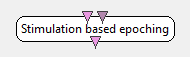

.. _Doc_BoxAlgorithm_StimulationBasedEpoching:

Stimulation based epoching
==========================

.. container:: attribution

   :Author:
      Jozef Legeny
   :Company:
      Mensia Technologies

Slices signal into chunks of a desired length following a stimulation event.

The aim of this box it to select some signal near a specific event. The event
is sent to the box in the form of an OpenViBE Stimulation. The author can
configure the duration of the selected signal and the offset of this selection
as regarding to the stimulation. For instance, it is possible to start the selection
a few hundreds of milliseconds *after* the event, or even a few hundreds of
milliseconds *before* the event.

Inputs
------

.. csv-table::
   :header: "Input Name", "Stream Type"

   "Input signal", "Signal"
   "Input stimulations", "Stimulations"

Input signal
~~~~~~~~~~~~

This input should receive the signal that contains the epoch to extract.
It is possible to pass either continuous signal or discontinuous signal.
However, it is good to know how it is expected to work before trying to
connect discontinuous signal.

Input stimulations
~~~~~~~~~~~~~~~~~~

This input should receive the stimulation that triggers a new
epoching. Any stimulation other than the one specified in the settings
will be silently ignored.

Outputs
-------

.. csv-table::
   :header: "Output Name", "Stream Type"

   "Epoched signal", "Signal"

Epoched signal
~~~~~~~~~~~~~~

This output will send the selected epochs of signal. This output
stream is discontinuous by design meaning that successive epochs are
not connected in time. It is possible to later re-epoch the output
signals if needed.

.. _Doc_BoxAlgorithm_StimulationBasedEpoching_Settings:

Settings
--------

.. csv-table::
   :header: "Setting Name", "Type", "Default Value"

   "Epoch duration (in sec)", "Float", "1"
   "Epoch offset (in sec)", "Float", "0.5"
   "Stimulation 1", "Stimulation", "OVTK_StimulationId_Label_00"

Epoch duration (in sec)
~~~~~~~~~~~~~~~~~~~~~~~

This setting defines the duration of the selected epoch (in seconds). For instance,
if you want to select 600ms of signal, you should enter 0.6

Epoch offset (in sec)
~~~~~~~~~~~~~~~~~~~~~

This setting defines the offset of the epoch as against the stimulation date.
This is where the selection starts. If this offset is greater than 0, then
the signal selection starts *after* the actual stimulation. If this
offset is less than 0, then the signal selection starts *before* the actual
stimulation. Refer to :ref:`Doc_BoxAlgorithm_StimulationBasedEpoching_Miscellaneous` for
more detailed examples

Stimulation 1
~~~~~~~~~~~~~~~~~~~~~~~~~

This setting defines the stimulation identifier which should trigger
a new epoching. Each time this stimulation is received, a new epocher
starts and a new epoch should be sent.

.. _Doc_BoxAlgorithm_StimulationBasedEpoching_Examples:

Examples
--------

In the case of motor imagery, the user is usually instructed to imagine
either left or right hand movement. This mental task typically runs for
5 seconds. So selecting the signal block related to the imagination
of left hand movement can be done with this box using the following
parameters :

- duration : 5 seconds
- offset : 0 second
- stimulation : OVTK_GDF_Left

In case you'd want to avoid the first half second (because it could
reflect a phase where the user is *starting* to perform the task)
and wand to avoir the last half second (because it could reflect a phase
where the user is exhausted and does not perform the taks optimally), then
you could use the following parameters :

- duration : 4 seconds
- offset : 0.5 seconds
- stimulation : OVTK_GDF_Left

.. _Doc_BoxAlgorithm_StimulationBasedEpoching_Miscellaneous:

Miscellaneous
-------------

**1. Continuous signal**

Suppose that we want to grab 1 second of signal following a specific stimulation code.
Suppose that the actual stimulation happens at *t=3.5* and *t=6*. Then the following figure
illustrate how epochs will be built. (*Ix* represents the x*th* input epoch and
*Ox* represents the x*th* output epoch)

.. code::

   +----+ +----+ +----+ +----+ +----+ +----+ +----+ +----+ +----+
   input  = | I1 | | I2 | | I3 | | I4 | | I5 | | I6 | | I7 | | I7 | | I9 | ...
   +----+ +----+ +----+ +----+ +----+ +----+ +----+ +----+ +----+
   +----+           +----+
   output =                        | O1 |           | O2 |                 ...
   +----+           +----+
   
   time   =      1      2      3      4      5      6      7      8      9
   stim   =                        ^                ^

Suppose that we want to grab 3 seconds of signal beginning 1 second before a specific stimulation code.
Suppose that the actual stimulation happens at *t=1.5* and *t=6*. Then the following figure
illustrate how epochs will be built. (*Ix* represents the x*th* input epoch and
*Ox* represents the x*th* output epoch)

.. code::

   +----+ +----+ +----+ +----+ +----+ +----+ +----+ +----+ +----+
   input  = | I1 | | I2 | | I3 | | I4 | | I5 | | I6 | | I7 | | I7 | | I9 | ...
   +----+ +----+ +----+ +----+ +----+ +----+ +----+ +----+ +----+
   +------------------+           +------------------+
   output =   |        O1        |           |        O2        |          ...
   +------------------+           +------------------+
   
   time   =      1      2      3      4      5      6      7      8      9
   stim   =          ^                              ^

Overlapping epochs would also work as defined on the following example...
Suppose that we want to grab 3 seconds of signal beginning 1 second before a specific stimulation code.
Suppose that the actual stimulation happens at *t=1.5*, *t=2* and *t=6*. Then the following figure
illustrate how epochs will be built. (*Ix* represents the x*th* input epoch and
*Ox* represents the x*th* output epoch)

.. code::

   +----+ +----+ +----+ +----+ +----+ +----+ +----+ +----+ +----+
   input  = | I1 | | I2 | | I3 | | I4 | | I5 | | I6 | | I7 | | I7 | | I9 | ...
   +----+ +----+ +----+ +----+ +----+ +----+ +----+ +----+ +----+
   +------------------+           +------------------+
   |        O1        |           |        O3        |
   output =   +------------------+           +------------------+          ....
   +------------------+
   |        O2        |
   +------------------+
   
   time   =      1      2      3      4      5      6      7      8      9
   stim   =          ^  ^                           ^

**2. Discontinuous signal**

The case where input signal is not continuous (for instance, the signal has already been epoched with
either a :ref:`Doc_BoxAlgorithm_StimulationBasedEpoching` or a :ref:`Doc_BoxAlgorithm_TimeBasedEpoching` box)
can be tricky... Indeed, it is not possible to join input epochs correctly. The epoching only consists
in signal extraction from an individual input chunk.

For instance, suppose the following input signal (*Ix* represents the x*th* input epoch) :

.. code::

   +------------------+        +------------------+        +-----
   input  = |        I1        |        |        I2        |        |      ...
   +------------------+        +------------------+        +-----
   time   =      1      2      3      4      5      6      7      8      9

Suppose that we want to grab 1 second of signal following a specific stimulation code.
Suppose that the actual stimulation happens at *t=1*, *t=2*, *t=4.5* and *t=6.5*. Then the following figure
illustrate how epochs will be built. (*Ix* represents the x*th* input epoch and
*Ox* represents the x*th* output epoch)

.. code::

   +------------------+        +------------------+        +-----
   input  = |        I1        |        |        I2        |        |      ...
   +------------------+        +------------------+        +-----
   +----+ +----+            +----+
   output =      | O1 | | O2 |            | O3 |                           ...
   +----+ +----+            +----+
   
   time   =      1      2      3      4      5      6      7      8      9
   stim   =      ^      ^                 ^             ^

In this case, note that the last stimulation at *t=6.5* can not generate a valid epoch. Indeed, the input
signal does not cover the time period from *t=6.5* to *t=7.5* so no epoch should be generated.

