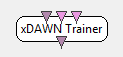

.. _Doc_BoxAlgorithm_XDAWNTrainer:

xDAWN Trainer
=============

.. container:: attribution

   :Author:
      Yann Renard
   :Company:
      Mensia Technologies

Trains spatial filters that best highlight Evoked Response Potentials (ERP) such as P300

This box can be used in order to compute a spatial filter in order to enhance the
detection of evoked response potentials. In order to compute such filter, this box
needs to receive the whole contain of a session on the first hand, and a succession
of evoked response potentials on the other hand. It then computes the averaged evoked
response potential computes the spatial filter that makes this averaged potential
appear in the whole signal. This can be used e.g. for better P300 signal detection.

It is important to consider the fact that this box will have best results for a
reasonably big number of input channels, possibly all over the scalp (areas where
the evoked response potential can not be seen will be naturally used as references
to reduce noise). The spatial filter results in space reduction to only keep significant
chanels for later detection. Consider using at least 4 times more input channels than
the number of output channels you want. For example, reducing 16 electrodes to 3 channels
for P300 detection is OK.

For more details about xDAWN, see <a href="http://www.icp.inpg.fr/~rivetber/Publications/references/Rivet2009a.pdf">Rivet et al. 2009</a>
or in case this links disapears, <a href="http://www.ncbi.nlm.nih.gov/pubmed/19174332">this website</a>.

Inputs
------

.. csv-table::
   :header: "Input Name", "Stream Type"

   "Stimulations", "Stimulations"
   "Session signal", "Signal"
   "Evoked potential epochs", "Signal"

Stimulations
~~~~~~~~~~~~

This input receives the exepriment stimulations. As soon as the "train"
stimulation is received, the spatial filter is computed.

Session signal
~~~~~~~~~~~~~~

This input should receive the whole signal of the session.

Evoked potential epochs
~~~~~~~~~~~~~~~~~~~~~~~

This input should receive the multiple evoked response potentials.

Outputs
-------

.. csv-table::
   :header: "Output Name", "Stream Type"

   "Train-completed Flag", "Stimulations"

.. _Doc_BoxAlgorithm_XDAWNTrainer_Settings:

Settings
--------

.. csv-table::
   :header: "Setting Name", "Type", "Default Value"

   "Train stimulation", "Stimulation", "OVTK_StimulationId_Train"
   "Spatial filter configuration", "Filename", ""
   "Filter dimension", "Integer", "4"
   "Save as box config", "Boolean", "true"

Train stimulation
~~~~~~~~~~~~~~~~~

This setting contains the stimulation to use to trigger the training process.

Spatial filter configuration
~~~~~~~~~~~~~~~~~~~~~~~~~~~~

This setting tells the box what configuration file to generate. This configuration file can
be used to set the correct values of a :ref:`Doc_BoxAlgorithm_SpatialFilter` box.

Filter dimension
~~~~~~~~~~~~~~~~

This setting tells how many dimension should be kept out of the spatial filter.

Save as box config
~~~~~~~~~~~~~~~~~~

If true, the file written will be a box configuration override especially for a spatial filter box. Otherwise, it will be an ASCII matrix.

