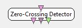

.. _Doc_BoxAlgorithm_ZeroCrossingDetector:

Zero-Crossing Detector
======================

.. container:: attribution

   :Author:
      Quentin Barthelemy
   :Company:
      Mensia Technologies

Detects zero-crossings of the signal for each channel, with 1 for positive zero-crossings (negative-to-positive), -1 for negatives ones (positive-to-negative), 0 otherwise. For all channels, stimulations mark positive and negatives zero-crossings. For each channel, the rythm is computed in events per min.

Using an hysteresis thresholding, this box detects the zero-crossings of the input, operating on all channels.

Inputs
------

.. csv-table::
   :header: "Input Name", "Stream Type"

   "Input signal", "Signal"

Input signal
~~~~~~~~~~~~

The input signal :math:`X \in \mathbb{R}^{C \times N}`, composed of :math:`C` sensors and :math:`N` samples.

Outputs
-------

.. csv-table::
   :header: "Output Name", "Stream Type"

   "Zero-crossing signal", "Signal"
   "Zero-crossing stimulations", "Stimulations"
   "Events rythm (per min)", "Streamed matrix"

Zero-crossing signal
~~~~~~~~~~~~~~~~~~~~

Zero-crossing signal :math:`Z \in \mathbb{R}^{C \times N}`, composed of :math:`C` sensors and :math:`N` samples.
It is defined as 1 for positive zero-crossings (negative-to-positive), -1 for negatives ones (positive-to-negative), 0 otherwise.

Zero-crossing stimulations
~~~~~~~~~~~~~~~~~~~~~~~~~~

For all channels, stimulations mark positive and negatives zero-crossings.

Events rythm (per min)
~~~~~~~~~~~~~~~~~~~~~~

For each channel, the rythm of negative-to-positive zero-crossings is computed in events per min.

.. _Doc_BoxAlgorithm_ZeroCrossingDetector_Settings:

Settings
--------

.. csv-table::
   :header: "Setting Name", "Type", "Default Value"

   "Hysteresis threshold", "Float", "0.01"
   "Rythm estimation window (in sec)", "Float", "10"
   "Negative-to-positive stimulation", "Stimulation", "OVTK_StimulationId_ThresholdPassed_Positive"
   "Positive-to-negative stimulation", "Stimulation", "OVTK_StimulationId_ThresholdPassed_Negative"

Hysteresis threshold
~~~~~~~~~~~~~~~~~~~~

This setting defines the value :math:`t` of the hysteresis threshold, to provide a robust detection. 

.. figure:: images/ZeroCrossingDetector_thresholding.png
   :alt: Difference between naive and hysteresis sign thresholding
   :align: center

   Difference between naive and hysteresis sign thresholding

Rythm estimation window (in sec)
~~~~~~~~~~~~~~~~~~~~~~~~~~~~~~~~

This setting defines the length of the time window for the rythm estimation.

Negative-to-positive stimulation
~~~~~~~~~~~~~~~~~~~~~~~~~~~~~~~~

This setting defines the stimulation id for negative-to-positive crossings.

Positive-to-negative stimulation
~~~~~~~~~~~~~~~~~~~~~~~~~~~~~~~~

This setting defines the stimulation id for positive-to-negative crossings.

