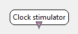

.. _Doc_BoxAlgorithm_ClockStimulator:

Clock stimulator
================

.. container:: attribution

   :Author:
      Yann Renard
   :Company:
      INRIA/IRISA

Triggers stimulation at fixed frequency

This box produces stimulations at specific times depending on
its configuration. The stimulation interval is fixed.

It is important to underline that this box runs as fast as possible
thus producing empty :ref:`Doc_Streams_Stimulation` chunks when needed.

Outputs
-------

.. csv-table::
   :header: "Output Name", "Stream Type"

   "Generated stimulations", "Stimulations"

Generated stimulations
~~~~~~~~~~~~~~~~~~~~~~

This output contains the generated stimulation stream.

.. _Doc_BoxAlgorithm_ClockStimulator_Settings:

Settings
--------

.. csv-table::
   :header: "Setting Name", "Type", "Default Value"

   "Interstimulation interval (in sec)", "Float", "1.0"
   "Stimulation", "Stimulation", "OVTK_StimulationId_Label_00"

Interstimulation interval (in sec)
~~~~~~~~~~~~~~~~~~~~~~~~~~~~~~~~~~

The first setting :math:`i` informs the box how often it should produce stimulations, with :math:`i > 0`.

Stimulation
~~~~~~~~~~~

The second setting gives the stimulation code to trigger.

.. _Doc_BoxAlgorithm_ClockStimulator_Examples:

Examples
--------

In the designer, drag'n drop a :ref:`Doc_BoxAlgorithm_StimulationListener`
and connect it to a clock stimulator box. Configure it to your preferred
active log level, press start and see what happens.

The output should like this :

.. code::

   [  INF  ] <Box algorithm::Stimulation listener> For input 0 (0x0) with name Stimulation stream 1 got stimulation 33024 (0x8100)[OVTK_StimulationId_Label_00] at date 4294967296 (0x100000000) and duration 0 (0x0)
   [  INF  ] <Box algorithm::Stimulation listener> For input 0 (0x0) with name Stimulation stream 1 got stimulation 33024 (0x8100)[OVTK_StimulationId_Label_00] at date 8589934592 (0x200000000) and duration 0 (0x0)
   [  INF  ] <Box algorithm::Stimulation listener> For input 0 (0x0) with name Stimulation stream 1 got stimulation 33024 (0x8100)[OVTK_StimulationId_Label_00] at date 12884901888 (0x300000000) and duration 0 (0x0)
   ...

.. _Doc_BoxAlgorithm_ClockStimulator_Miscellaneous:

Miscellaneous
-------------

Notice that no stimulation is sent a time 0. The first stimulation to be sent
has the inter stimulation duration as date.

