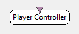

.. _Doc_BoxAlgorithm_PlayerController:

Player Controller
=================

.. container:: attribution

   :Author:
      Yann Renard
   :Company:
      INRIA

This box can execute one of these actions on the current player instance on a trigger:

- Play
- Fast Forward
- Pause
- Stop

The box triggers upon receiving a specific stimulation on the Stimulations
input.

Due to the nature of the triggers, Play and Fast Forward actions can only be
used while the player is actually playing or in fast forward.

Inputs
------

.. csv-table::
   :header: "Input Name", "Stream Type"

   "Stimulations", "Stimulations"

.. _Doc_BoxAlgorithm_PlayerController_Settings:

Settings
--------

.. csv-table::
   :header: "Setting Name", "Type", "Default Value"

   "Stimulation name", "Stimulation", "OVTK_StimulationId_Label_00"
   "Action to perform", "Player Action", "Pause"

Stimulation name
~~~~~~~~~~~~~~~~

Input stimulation to react to

Action to perform
~~~~~~~~~~~~~~~~~

Scenario player action to perform when stimulation is received. The options are 'forward', 'pause', 'play' and 'stop'.

