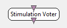

.. _Doc_BoxAlgorithm_StimulationVoter:

Stimulation Voter
=================

.. container:: attribution

   :Author:
      Jussi T. Lindgren
   :Company:
      Inria

Votes the most frequent stimulus ID in a given time window. Outputs the winning stimulus type. Several options are possible. To process multiple inputs, use Stimulation Multiplexer first.

This box reads all the incoming stimuli a stimulus channel and returns the stimulus ID with the highest number of occurrences. Some constraints can be specified as box parameters.

Inputs
------

.. csv-table::
   :header: "Input Name", "Stream Type"

   "Stimulus input", "Stimulations"

Collects the stimuli from a single input. To use several inputs, combine them first with Stimulation Multiplexer. 

Stimulus input
~~~~~~~~~~~~~~

Input stream, can include any stimuli.

Outputs
-------

.. csv-table::
   :header: "Output Name", "Stream Type"

   "Selected stimulus", "Stimulations"

Selected stimulus
~~~~~~~~~~~~~~~~~

The output sends a new stimulation as soon as the most frequent stimulus type passes the criteria specified by the box parameters.

.. _Doc_BoxAlgorithm_StimulationVoter_Settings:

Settings
--------

.. csv-table::
   :header: "Setting Name", "Type", "Default Value"

   "Number of stimuli required for vote", "Integer", "4"
   "Time window (secs)", "Float", "2"
   "Clear votes", "Clear votes", "After output"
   "Output timestamp", "Output time", "Time of last voting stimulus"
   "Reject class label", "Stimulation", "OVTK_StimulationId_Label_00"
   "Reject class can win", "Reject can win", "No"

Number of stimuli required for vote
~~~~~~~~~~~~~~~~~~~~~~~~~~~~~~~~~~~

Minimum number of incoming stimulus required to be inside the time window to carry out a vote.

Time window (secs)
~~~~~~~~~~~~~~~~~~

The length of the time window. Stimuli are discarded after they drop outside the time window.

Clear votes
~~~~~~~~~~~

You can specify that stimuli can either vote as long as they remain inside the time window,
or that they are discarded after they participate in a single successful vote.

Output timestamp
~~~~~~~~~~~~~~~~

The output stimulus can be tagged with either the time of vote, the time of the last occurrence of the winning stimulus type, or the time of the last stimulus that participated in the vote.

Reject class label
~~~~~~~~~~~~~~~~~~

Specifies the class interpreted as the 'rejected' class.

Reject class can win
~~~~~~~~~~~~~~~~~~~~

If set to 'no', 'rejected' class never wins the votes and is never returned as output.

.. _Doc_BoxAlgorithm_StimulationVoter_Examples:

Examples
--------

Possible usages include aggregating classifier outputs by making a majority vote over them.

.. _Doc_BoxAlgorithm_StimulationVoter_Miscellaneous:

Miscellaneous
-------------

This algorithm is similar to the Voting Classifier but it allows more parameters. Also, all stimulus available at 
time step *t* are used to carry out the vote at time step *t*. On the other hand, Stimulation Voter only supports input streams of type Stimulus.

