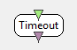

.. _Doc_BoxAlgorithm_Timeout:

Timeout
=======

.. container:: attribution

   :Author:
      Jozef Legény
   :Company:
      Inria

Sends a stimulation after a period of time without receiving signal. Useful for stopping scenarios after hardware disconnection.

This box will send a stimulation on its output after it stops receiving an input. The user
can set a duration to wait before considering the output inactive.

Inputs
------

.. csv-table::
   :header: "Input Name", "Stream Type"

   "Input Stream", "Streamed matrix"

Input Stream
~~~~~~~~~~~~

Streamed Matrix input to be monitored.

Outputs
-------

.. csv-table::
   :header: "Output Name", "Stream Type"

   "Output Stimulations", "Stimulations"

Output Stimulations
~~~~~~~~~~~~~~~~~~~

Output stimulation. One stimulation will be sent after the timeout is reached.

.. _Doc_BoxAlgorithm_Timeout_Settings:

Settings
--------

.. csv-table::
   :header: "Setting Name", "Type", "Default Value"

   "Timeout delay", "Integer", "5"
   "Output Stimulation", "Stimulation", "OVTK_StimulationId_Label_00"

Timeout delay
~~~~~~~~~~~~~

Timeout value. Duration (in seconds) to wait after the last received chunk before the input is considered inactive.

Output Stimulation
~~~~~~~~~~~~~~~~~~

Sitmulation ID to send.

