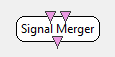

.. _Doc_BoxAlgorithm_SignalMerger:

Signal Merger
=============

.. container:: attribution

   :Author:
      Yann Renard
   :Company:
      INRIA

This box merges several input streams in a single output stream. For instance,
if this box has two inputs with 8 channels each, the output will contain 16 channels.

It important to note that the input streams must have the same structure. That is
same sampling rate, same number of samples per buffer, and similar chunks dates.

The output channel order is as follows :

- n channels from input 1 (in the same order as in input 1)
- m channels from input 2
- ...
- p channels from input N

Such box has initially been proposed by Matthieu Goyat and Guillaume Lio but it
has been completely reimplemented in march 2011 because of unpredictable behaviors in
some conditions.

Inputs
------

.. csv-table::
   :header: "Input Name", "Stream Type"

   "Input 1", "Signal"
   "Input 2", "Signal"

This box can receive as many inputs as necessary.

Input 1
~~~~~~~

The first input stream.

Input 2
~~~~~~~

The second input stream.

Outputs
-------

.. csv-table::
   :header: "Output Name", "Stream Type"

   "Merged", "Signal"

Merged
~~~~~~

The output stream contains all the channels grabbed from the different input streams.

