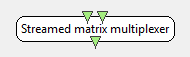

.. _Doc_BoxAlgorithm_StreamedMatrixMultiplexer:

Streamed matrix multiplexer
===========================

.. container:: attribution

   :Author:
      Yann Renard
   :Company:
      INRIA/IRISA

This box multiplexes streamed matrix stream on a low level basis (at the EBML stream level actually).
This means the box sorts the different buffers received from its inputs and sends all of them
on its output. For correct results, this supposes the inputs have "homogeneous content" in the sense that
they should have e.g. the same number of channels, in the same order, the same number of samples per buffer etc...

This box is usually used after an epoching related split in the pipeline, when you want to process the signals
in a similar manner for a similar purpose. This actually joins the pipelines in only one, dropping the need
to edit and execute similar boxes.

**Warning:** this box is usually misused and used in place of a :ref:`Doc_BoxAlgorithm_SignalMerger` box.
Please consider reading this documentation twice, and maybe read the :ref:`Doc_BoxAlgorithm_SignalMerger`
documentation once again as well :)

Inputs
------

.. csv-table::
   :header: "Input Name", "Stream Type"

   "Input stream 1", "Streamed matrix"
   "Input stream 2", "Streamed matrix"

You can add as many input as you want.

Input stream 1
~~~~~~~~~~~~~~

The first input stream.

Input stream 2
~~~~~~~~~~~~~~

The second input stream.

Outputs
-------

.. csv-table::
   :header: "Output Name", "Stream Type"

   "Multiplexed streamed matrix", "Streamed matrix"

Multiplexed streamed matrix
~~~~~~~~~~~~~~~~~~~~~~~~~~~

The output stream takes the header of the first stream and then sends buffers of the
different input streams in a sorted way.

