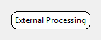

.. _Doc_BoxAlgorithm_ExternalProcessing:

External Processing
===================

.. container:: attribution

   :Author:
      Alexis Placet
   :Company:
      Mensia Technologies SA

Launches an external program which can then process data. This box and the program communicate using TCP connection and a defined protocol.

This box allows to externalize data processing into an external program. It sends EBML data in chunks
according to a specified protocol, the external application must respond with an EBML response following
this same protocol.

A SDK for C++ and Python 3 (Python NeuroRT Box) are provided in order to simplify the development of
external boxes.

This box can work in two modes, either it launches the external program itself, or it will wait for client
connections during the initialize step.

.. _Doc_BoxAlgorithm_ExternalProcessing_Settings:

Settings
--------

.. csv-table::
   :header: "Setting Name", "Type", "Default Value"

   "Launch third party program", "Boolean", "true"
   "Executable path", "Filename", ""
   "Arguments", "String", ""
   "Port", "Integer", "0"
   "Automatic connection identifier", "Boolean", "true"
   "Custom connection identifier", "String", ""
   "Incoming connection timeout", "Integer", "10"
   "Generator", "Boolean", "false"

The External Processing box has several settings. The first eight parameters are reserved for the
box. Any additional parameters will be passed to the external program.

Launch third party program
~~~~~~~~~~~~~~~~~~~~~~~~~~
If true, the box will attempt to start the external program automatically. 
We advise to use this mode in production.

If this setting is false, then the box will stop 
during the initialize step and wait for the external program to connect during the time speficied by the Connection Timeout setting.
This mode is useful during development, since it allows to run the program manually and check the console.
 

Executable path
~~~~~~~~~~~~~~~

Path to the executable to run. This parameter is only used if the first parameter is activated.

Example: OpenViBE SDK comes with two example programs, one can be found in ``${Path_Bin}/sdk-examples-communication-client-filter``

Example: In the case you want to run a Python script on Windows, the program you are running is python, e.g: ``C:/Python35/python.exe``

Arguments
~~~~~~~~~

Arguments passed to the third party program, if any are necessary. This parameter is only used if the first parameter is activated.

This parameter will be given to the third party program as is, thus it is necessary to quote any arguments that contain spaces.

Example: In the case you want to run a Python script on Windows, the parameter is the absolute path to the script that you want to run, e.g.: ``C:/MyProject/myprogram.py`` or ``-m mylibrary.mymodule.mybox``.

Port
~~~~

The TCP port that the box is listening. It must be in the range 49152-65535 or it can be 0, in which case the port will be chosen
automatically.

The box acts as a Socket server and the external program as a client. If you have several External Processing boxes in the same scenario
each has to work on a different port.

We advise to use port ``0`` in production.

An argument, with the value of the port, will be given to the third party program (after the Arguments parameter ) as: ``--port PORT``

This means that your external program must accept the ``--port`` parameter and use it to connect to this box.

Automatic connection identifier
~~~~~~~~~~~~~~~~~~~~~~~~~~~~~~~

Whether or not to generate of a connection identifier for the connection. See the next setting for explanation.

Custom connection identifier
~~~~~~~~~~~~~~~~~~~~~~~~~~~~

This argument will be passed to the external program as a command line parameter: ``--connection-id CONNECTIONID`` and will be communicated to your
program through the protocol as well. You should check that the two are matching in order to avoid a clash if two boxes would be using the same
port.

We advise you to use an automatic identifier generation in production. Choose your custom connection identifier is however necessary when running
the external program explicitly.

Incoming connection timeout
~~~~~~~~~~~~~~~~~~~~~~~~~~~

A timeout, in seconds, for the incoming connection acceptance.

Generator
~~~~~~~~~

This setting changes how often the box will process data. Each data processing requires that the box will
wait until it has received a response from the external program. Too many of these synchronisations can
induce a severe performance penalty.

If the box is a generator, then it will wait for the external program on each step. If the scenario is
played in real-time, then the box will poll the external program at 16Hz. If the scenario is in fast-forward
the refresh frequency of this box is 1Hz.

If this setting is set to false, the box will send all data it receives into the external program and wait
until it processes it and sends it back.

.. _Doc_BoxAlgorithm_ExternalProcessing_Miscellaneous:

Miscellaneous
-------------

Performances
~~~~~~~~~~~~
This box requires synchronization with the external program in order to process data correctly and in order.
As the synchronization is a relatively slow process with regards to the duration of one update cycle (62ms) it
is better to try to limit the number of chunks that are send between the box and the client application.

If you find that your scenario is too slow, try using time based epoching in front of it to make chunks of data
larger.

Development mode
~~~~~~~~~~~~~~~~
While developing your program, you may want to run it in Debug mode in your environment.

In order to run your program manually you should change the settings of the box:
  * uncheck option ``Launch Third Party Program``,
  * uncheck option ``Automatic connection identifier``,
  * change the default port, for example to ``59595``, (make sure this is the default port used by your program)
  * make sure the setting ``Incoming connection timeout`` will leave you enough time to run your program manually (default setting should be enough)

Then, you can first run your scenario through NeuroRT Studio, and then run your program manually.

