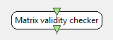

.. _Doc_BoxAlgorithm_MatrixValidityChecker:

Matrix validity checker
=======================

.. container:: attribution

   :Author:
      Yann Renard
   :Company:
      INRIA/IRISA

This box is for debugging purposes and allows an author to check the validity of a streamed matrix and derived stream. This box can log a message, stop the player or interpolate data.

Ensures values stored in a matrix are valid, i.e. regular floating point values as opposed to NaN (not a number) or infinite.

Inputs
------

.. csv-table::
   :header: "Input Name", "Stream Type"

   "Stream 1", "Streamed matrix"

Outputs
-------

.. csv-table::
   :header: "Output Name", "Stream Type"

   "Output stream 1", "Streamed matrix"

.. _Doc_BoxAlgorithm_MatrixValidityChecker_Settings:

Settings
--------

.. csv-table::
   :header: "Setting Name", "Type", "Default Value"

   "Log level", "Log level", "Warning"
   "Action to do", "Action to do", "Log warning"

Log level
~~~~~~~~~

Log level of messages to be printed whenever Nan or infinite values are found in input matrix.

